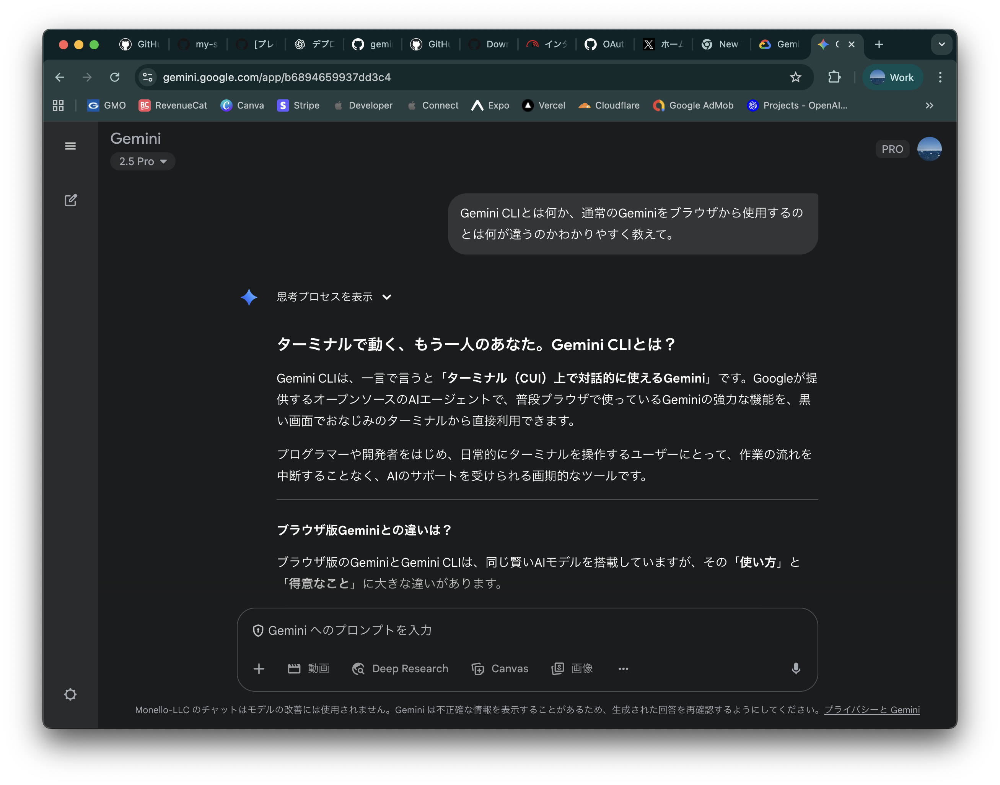
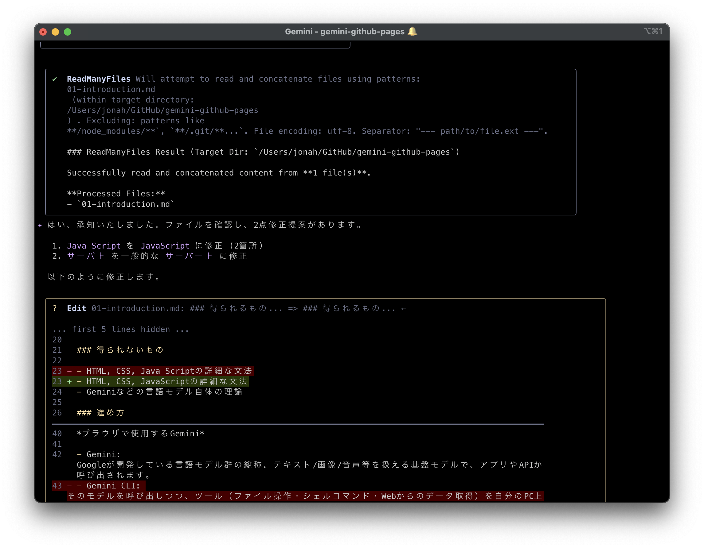

# はじめに

### 目的

- AIエージェントであるGemini CLIを用いて、GitHub Pages上にサイトを構築する方法を学び、実際に公開する

### 得られるもの

- Gemini CLIの導入方法と使い方
- Gitの基礎的な操作、GitHubの使い方
- GitHub Codespaces（VS Code）の使い方
- HTML、CSS、JavaScriptを使ったWebサイトの作成方法

### 得られないもの

- HTML、CSS、JavaScriptの詳細な文法
- Geminiなどの言語モデル自体の理論

### 進め方

- わからないことは積極的に周りの人やChatGPT、Geminiに聞きましょう
- すでにGitやGitHubに慣れている人は、どんどん進めて構いません。周りの人が困っていたら助けてあげましょう

## Gemini CLIとは

- Googleが提供するオープンソースのAIエージェントです。
- ターミナル上でGeminiモデルを利用してコード生成・修正や文章作成など、複数の作業を自然言語で操作できます

### GeminiとGemini CLIの違い

*ブラウザーで使用するGemini*

- Gemini: Googleが開発している言語モデル群の総称。テキスト・画像・音声などを扱える基盤モデルで、アプリやAPIから呼び出されます。
- Gemini CLI: そのモデルを呼び出しつつ、ツール（ファイル操作・シェルコマンド・Webからのデータ取得）を自分のPCやサーバー上で実行できるエージェント実行環境です。

*Gemini CLIが講義資料を校正する様子*

💡 API と CLI とは

### APIとは
**API（Application Programming Interface）** は、異なるソフトウェア同士が情報をやり取りするための「窓口」のようなものです。

#### プログラミングでの例
- **天気アプリ** → 天気予報 API → **気象データサービス**
- **地図アプリ** → マップ API → **地図データサービス**
- **今回の例** → Gemini API → **Googleの言語モデル**

### CLIとは
**CLI（Command Line Interface）** は、文字だけでコンピューターを操作する方法です。

#### GUIとCLIの違い
- **GUI（Graphical User Interface）**：マウスでアイコンをクリックして操作
  - 例：フォルダーをダブルクリックして開く
- **CLI**：キーボードでコマンド（命令文）を入力して操作
  - 例：`ls`（ファイル一覧を表示）、`cd`（フォルダー移動）

#### CLIの利点
1. **高速操作**：慣れると画面をクリックするより早い
2. **自動化**：同じ作業を繰り返し実行できる
3. **正確性**：間違いなく同じ操作を何度でも実行できる

## GitHubアカウントを作成しよう

Webサイトを公開したり、開発を行う上では **GitHub アカウント** があると便利（ほぼ必須）です。

1. ブラウザーで [https://github.com](https://github.com) を開く  
2. 右上の **Sign up** をクリック  
3. メールアドレス・ユーザー名・パスワードを入力し、画面の指示に従って登録  
4. 登録が完了すると、あなたの **GitHub プロフィールページ** が表示されます

## GitとGitHubとは

### Git
- **バージョン管理システム**のひとつです。
- 変更履歴（コミット）を記録し、差分を確認したり、任意の地点へ戻したりできます。
- 文書、プログラムを書いていて「さっき作業していたバージョンに戻したい」というときなどに便利です。
- **ブランチ**と呼ばれる、いわば作業用の別レーンを作って、他人と同時並行でプログラムを書いたりできます。

### GitHub
- Gitで管理するデータを**インターネット上で管理・共有**できるサービスです。
- 世界中の開発者が利用している最大級のプラットフォームです。
- 無料でWebサイトを公開できる「GitHub Pages」など、開発に便利な機能が複数存在します。
- Gitがバージョン管理の道具で、GitHubはその道具を使う場所（共有・協働のプラットフォーム）です。

前へ → [ホーム](./index.md)
次へ → [開発環境（Codespaces など）](./02-environment.md)
目次へ → [ホーム](./index.md)
