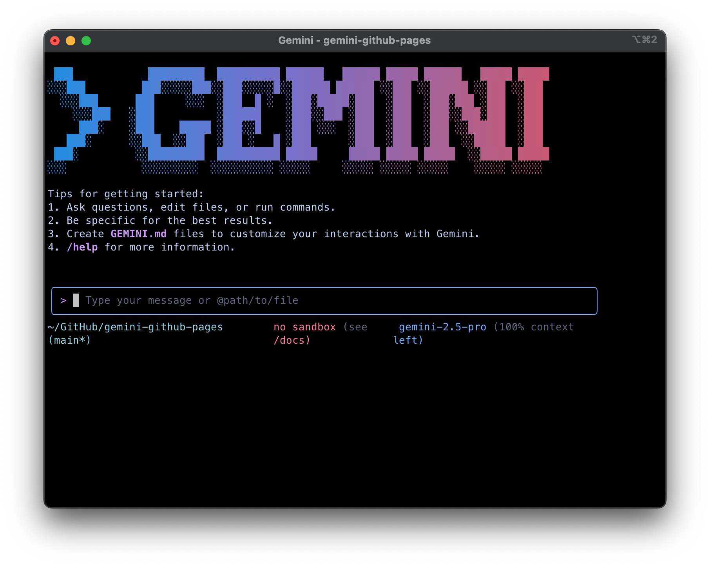
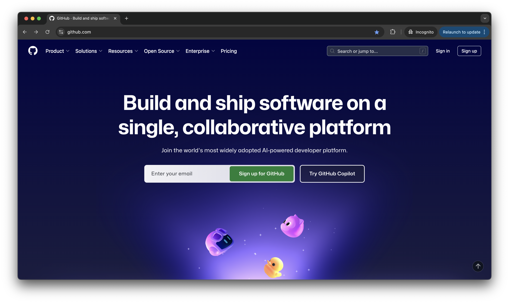

# はじめに・概要

## はじめに

### 目的

- AIエージェントであるGemini CLIを用いて、GitHub Pages上にサイトを構築する方法を学び、実際に公開する

### 得られるもの

- Gemini CLIの導入方法と使い方
- Gitの基礎の操作、GitHubの使い方
- VSCode(GitHub Codespaces)の使い方
- HTML, CSS, Java Scriptを使ったWebサイト作成の方法

### 得られないもの

- HTML, CSS, Java Scriptの詳細な文法
- Geminiなどの言語モデル自体の理論

### 進め方

- わからないことは積極的に近くの人やChatGPT, Geminiに聞きましょう
- すでにGit, GitHubに慣れていたりする人はどんどん進めて構いません。周りの人が困っていたら助けてあげましょう
- 講義スライドはありません。このWebページの内容を元に進めます

## Gemini CLIとは

- Googleが提供するオープンソースのAIエージェントです。
- ターミナル上でGeminiモデルを利用してコード生成・修正、文章作成など、複数の作業を自然言語で操作可能です

## GitHubアカウントを作成しよう

Web サイトを公開したり、開発を行う上では **GitHub アカウント** があると便利です

1. ブラウザで [https://github.com](https://github.com) を開く  
2. 右上の **Sign up** をクリック  
3. メールアドレス・ユーザー名・パスワードを入力し、画面の指示に従って登録  
4. 登録が完了すると、あなたの **GitHub プロフィールページ** が表示されます

## GitとGitHubとは

### Git
- **バージョン管理システム**の一つです
- ファイルの変更履歴を記録し、過去の状態に戻したり、変更内容を確認できます
- 例：文書、プログラムを書いていて「さっき作業していたバージョンに戻したい」というときなどに便利です

### GitHub
- Gitを使ったプロジェクトを**インターネット上で管理・共有**できるサービスです
- 世界中の開発者が利用している最大級のプラットフォームです
- 無料でWebサイトを公開できる「GitHub Pages」機能があります

### Git, GitHubが使われる理由
1. **失敗しても安心** - いつでも前の状態に戻せます
2. **共同作業が簡単** - 複数人で同じプロジェクトを編集できます
3. **無料でWebサイト公開** - GitHub Pagesで自分のサイトを世界に公開できます

---

次へ → [開発環境（Codespaces など）](./02-environment.md)
