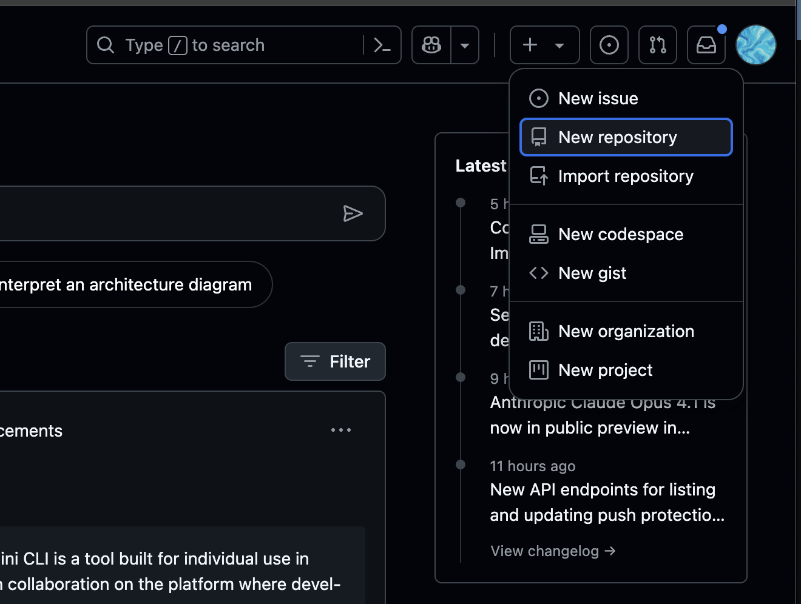
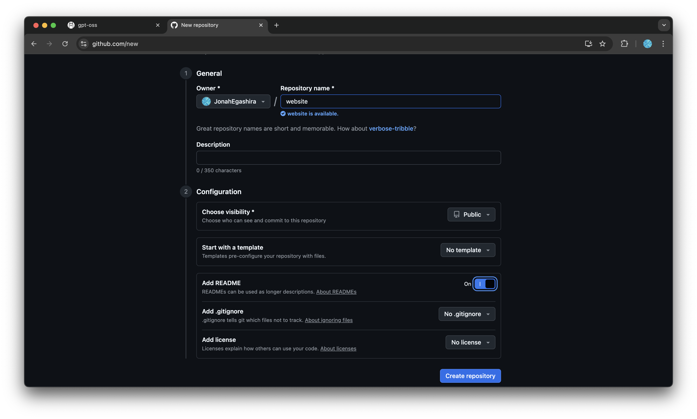
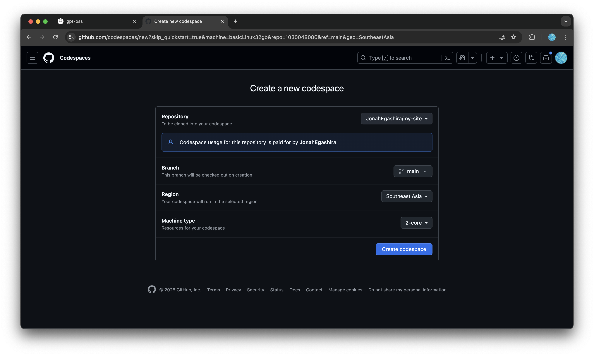
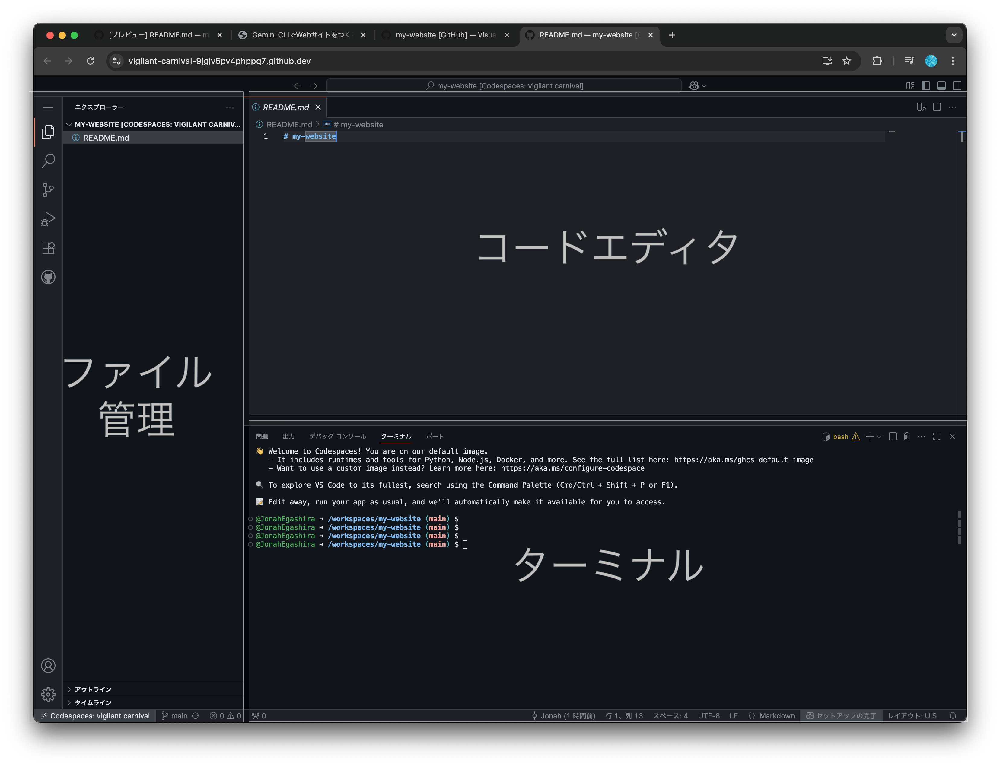
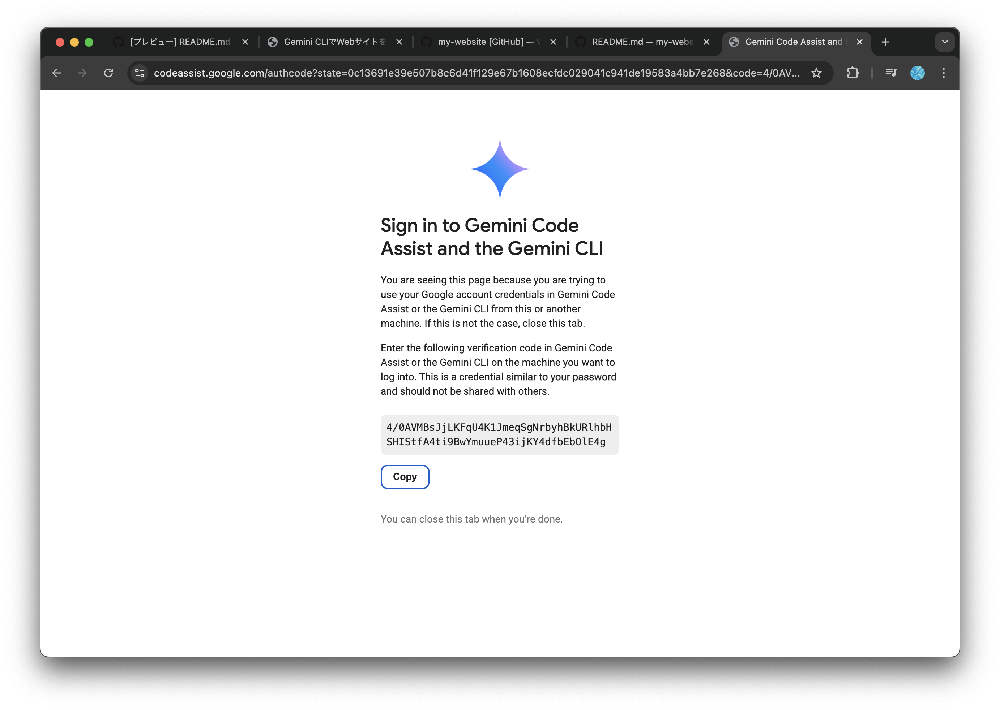
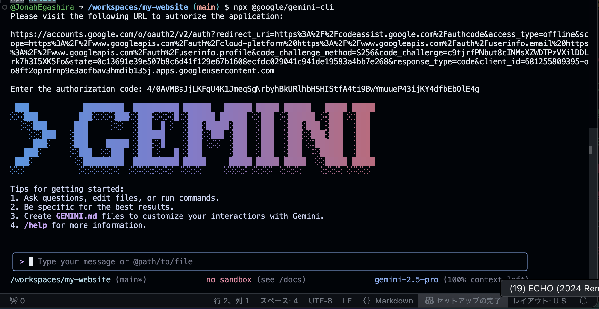

# 開発環境の準備

本講義中は、GitHub Codespacesを用いてGemini CLIを利用します。GitHub Codespacesは、クラウド上で開発環境を提供するサービスで、ブラウザだけで開発環境を利用できます。これにより、インストールやセットアップの手間を省き、すぐに開発を始めることができます。

| 選択肢 | 特長 | モチベーション |
|--------|------|--------------------|
| **GitHub Codespaces** | ◎ インストール不要<br/>◎ ブラウザだけで完結<br/>◎ 社用 PC でも OK | Gemini CLIだけとりあえず使ってみたい / セットアップを短時間で終わらせたい |
| **ローカルセットアップ** | ◎ 自分のPC上でAIエージェントが動く<br/>◎ ターミナル学習に最適 | コマンド操作を学びたい / 今後も本格的に開発をしてみたい |

---

# GitHub Codespaces とは？

* **クラウド上にあるパソコン**を、あなた専用の開発用に用意してくれるサービスです。
* 実際のパソコンは触らず、**インターネット経由でアクセス**して使います。

* **環境構築不要**
  自分のPCに何もインストールしなくても、すぐ開発を始められます。
* **どのPCでも同じ環境**
  チーム全員が同じ設定で作業できる

---

💡 例えるなら：

> 「自分専用のプログラミング用パソコンを、GitHub がクラウド上に貸してくれるサービス」
> 必要なときだけ呼び出して、終わったら閉じる感じです。

---

## GitHub Codespacesでの作業手順

まずはじめにGitHubでリポジトリを作成しましょう

### GitHub リポジトリを新規作成

- リポジトリとは、Gitで管理しているフォルダ、ディレクトリのことです。

<details markdown="1">
<summary>補足：💡フォルダ、ディレクトリ、リポジトリの違い</summary>

### **📦 フォルダ**

* パソコンの中でファイルを入れる「入れ物」
* 物理的なディレクトリ構造の見た目のこと

---

### **📂 ディレクトリ**

* フォルダとほぼ同じ意味ですが、**コンピュータ用語寄り**
* ターミナルやコマンドラインで「今いる場所」を指すときに「ディレクトリ」と言う
* 例：`cd my-site` は「my-site」というディレクトリに移動」

---

### **📁 リポジトリ（Repository）**

* Gitで管理されているフォルダ（＋その中の履歴データ）
* 普通のフォルダとの違いは「中に `.git` という隠しフォルダがあり、過去の履歴や設定が入っている」こと
* GitHubにアップすると、そのままインターネット上のリポジトリにもなる

</details>

1. [GitHub にログイン](https://github.com/login)し、右上の「＋」→ [**New repository**](https://github.com/new) をクリック  
 
2. Repository name に任意の名前 (例: `my-site`) を入力し、Add READMEをOnにして **Create repository**をクリック


### Codespace を起動
1. 作成したリポジトリのトップページがこのようになっていることを確認

2. 右上の「＋」→ **New Codespace** をクリック

3. Codespace作成の設定画面に移行するので、Repositoryから先ほど作成したリポジトリを選択。そのほかの設定はデフォルトのままでOK. **Create codespace**をクリック


## Codespacesの画面構成

GitHub Codespacesは、クラウド上で動作するVS Code（Visual Studio Code）のようなものです。VS Codeは、Microsoftが提供する無料のソースコードエディターで、多くのプログラミング言語をサポートし、拡張機能を通じて機能を追加することができます。

CodespacesおよびVS Codeの画面構成について簡単に説明します。



1. **ファイルエクスプローラー**  
   左側に表示されるファイルエクスプローラーは、プロジェクト内のファイルやフォルダを表示します。ここからファイルをクリックすることで、エディターで開くことができます。VS Codeでも同様に、プロジェクトの構造を視覚的に把握することができます。

2. **エディター**  
   画面中央に位置するエディターは、コードを編集するための領域です。VS Codeと同様に、シンタックスハイライトやコード補完機能が利用でき、効率的にコードを書くことができます。

3. **ターミナル**  
   画面下部に表示されるターミナルは、コマンドを実行するためのインターフェースです。ここでGitコマンドやnpmコマンドを実行して、プロジェクトの管理やビルドを行うことができます。VS Codeでもターミナルを内蔵しており、同様の操作が可能です。

### Gemini CLI を起動してログイン
Codespaces のターミナルで以下を実行します。
```bash
npx @google/gemini-cli
```

`npx`コマンドでGemini CLIがインストールされ実行されます。


- Google アカウントでのログインを求められるので、`1. Login with Google`を選択しましょう。


- `1. Login with Google`を選択したら、ターミナル上に出てくるURLをクリックします。
- 一度目ではこのURLが出てこない場合がありますが、その時は再度`npx @google/gemini-cli`を実行して下さい。


- URLをクリックするとGoogleでのログインが求められます。ログイン後、このようなページとコードが表示されるので、`Copy`を押してコードをコピーします。



- 再度Codespacesに戻り、このコードをペーストして、Enterを入力します。



成功すると、このような大きな`GEMINI`の文字が表示され、Gemini CLIに対してメッセージを送って使える状態になります。

ここまで確認できれば Codespaces 環境の準備は完了です。以降のサイトの作成・公開手順は「[Gemini CLIでWebサイトを作成する](./03-build-with-gemini.md)」セクションを参照してください。

---

## ローカル環境構築編（オプション）

自分のPC上でGemini CLIの環境を準備する方法は [ローカル環境構築編](./local-setup.md) に記載しています。興味のある方はぜひ取り組んでみて下さい。

---

次へ → [Gemini CLI でサイト作成](./03-build-with-gemini.md)
