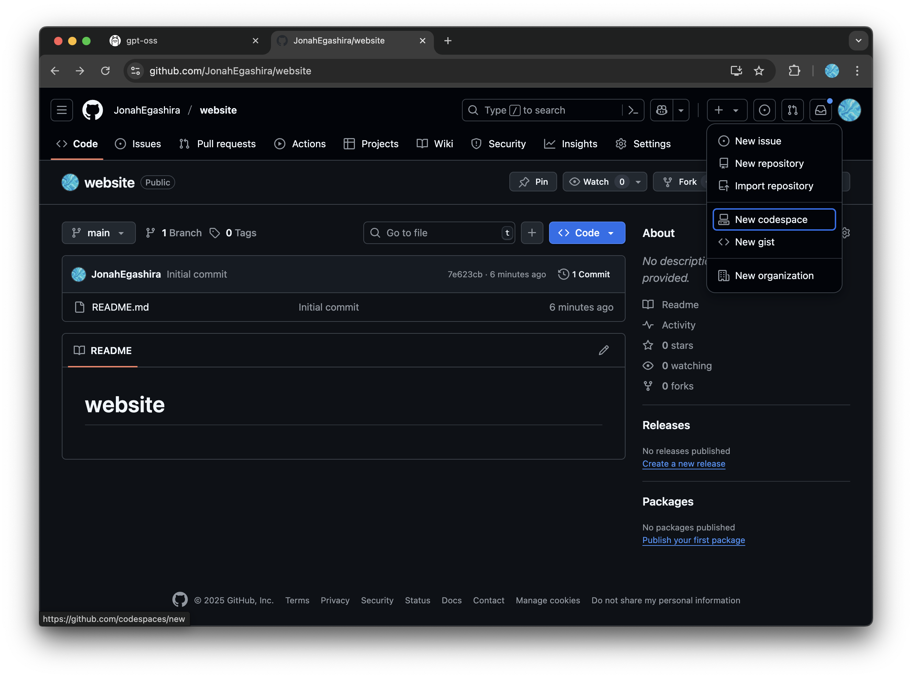

# 開発環境の準備

本講義中は、GitHub Codespacesを用いてGemini CLIを利用します。GitHub Codespacesは、クラウド上で開発環境を提供するサービスで、ブラウザだけで開発環境を利用できます。これにより、インストールやセットアップの手間を省き、すぐに開発を始めることができます。

---

# GitHub Codespaces とは？

GitHubが提供するクラウドの開発環境です。
[GitHub Codespaces](https://github.co.jp/features/codespaces)

* **環境構築不要**
  自分のPCに何もインストールしなくても、すぐ開発を始められます。
* **どのPCでも同じ環境**
  チーム全員が同じ設定で作業できる

## GitHub Codespacesでの作業手順

まずはじめにGitHubでリポジトリを作成しましょう

### GitHub リポジトリを新規作成

- リポジトリとは、Gitで管理しているフォルダ、ディレクトリのことです。

<details markdown="1">
<summary>補足：💡フォルダ、ディレクトリ、リポジトリの違い</summary>

### **📦 フォルダ**

* パソコンの中でファイルを入れる「入れ物」
* 物理的なディレクトリ構造の見た目のこと

---

### **📂 ディレクトリ**

* フォルダとほぼ同じ意味ですが、**コンピュータ用語寄り**
* ターミナルやコマンドラインで「今いる場所」を指すときに「ディレクトリ」と言う
* 例：`cd my-site` は「my-site」というディレクトリに移動」

---

### **📁 リポジトリ（Repository）**

* Gitで管理されているフォルダ（＋その中の履歴データ）
* 普通のフォルダとの違いは「中に `.git` という隠しフォルダがあり、過去の履歴や設定が入っている」こと
* GitHubにアップすると、そのままインターネット上のリポジトリにもなる

</details>

1. [GitHub にログイン](https://github.com/login)し、右上の「＋」→ [**New repository**](https://github.com/new) をクリック  
 
2. Repository name に任意の名前 (例: `my-site`) を入力し、`Add README`をOnにして **Create repository**をクリック


### Codespace を起動
1. 作成したリポジトリのトップページがこのようになっていることを確認

2. 右上の「＋」→ **New Codespace** をクリック

3. Codespace作成の設定画面に移行するので、Repositoryから先ほど作成したリポジトリを選択。そのほかの設定はデフォルトのままでOK. **Create codespace**をクリック


### Codespacesの料金について

Codespacesは毎月一定量まで無料で使用することができます。
個人用のGitHubアカウントには、月あたり15GBのストレージと、120コア時間の使用時間が付与されます。
コア時間は使用するマシンのスペックによって消費量が異なります。
2コアマシンを1時間使うと2コア時間を消費し、8コアマシンを1時間使うと8コア時間という計算です。詳しくは[GitHub Codespacesの料金について](https://docs.github.com/ja/billing/concepts/product-billing/github-codespaces)をご確認ください。

## Codespacesの画面構成

GitHub Codespacesは、クラウド上で動作するVS Code（Visual Studio Code）です。VS Codeは、Microsoftが提供する無料のソースコードエディターで、多くのプログラミング言語をサポートし、拡張機能を通じて機能を追加することができます。

Codespaces/VS Codeの画面構成について簡単に説明します。


1. **ファイルエクスプローラー**  
   左側に表示されるファイルエクスプローラーは、プロジェクト内のファイルやフォルダを表示します。ここからファイルをクリックすることで、エディターで開くことができます。VS Codeでも同様に、プロジェクトの構造を視覚的に把握することができます。

2. **エディター**  
   画面中央に位置するエディターは、コードを編集するための領域です。VS Codeと同様に、シンタックスハイライトやコード補完機能が利用でき、効率的にコードを書くことができます。

3. **ターミナル**  
   画面下部に表示されるターミナルは、コマンドを実行するためのインターフェースです。ここでGitコマンドやnpmコマンドを実行して、プロジェクトの管理やビルドを行うことができます。VS Codeでもターミナルを内蔵しており、同様の操作が可能です。

---

# Gemini CLI の起動
それでは実際にCodespaces上でGemini CLIを動かしてみましょう。

Codespaces のターミナルで以下を実行します。
```bash
npx @google/gemini-cli
```

`npx`コマンドでGemini CLIがCodespaces上のマシンにインストールされ実行されます。


- Google アカウントでのログインを求められるので、`1. Login with Google`を選択しましょう。

**⚠️注意**：慶應のGoogleアカウントではGeminiの利用が制限されていて使えません。個人のGoogleアカウントでログインしてください。


- `1. Login with Google`を選択したら、ターミナル上に出てくるURLをクリックします。
- 一度目ではこのURLが出てこない場合がありますが、その時は再度`npx @google/gemini-cli`を実行して下さい。


- URLをクリックするとGoogleでのログインが求められます。ログイン後、このようなページとコードが表示されるので、`Copy`を押してコードをコピーします。


- 再度Codespacesに戻り、このコードをペーストして、Enterを入力します。


成功すると、このような大きな`GEMINI`の文字が表示され、Gemini CLIに対してメッセージを送って使える状態になります。

ここまで確認できれば Codespaces 環境の準備は完了です。以降のサイトの作成・公開手順は「[Gemini CLIでWebサイトを作成する](./03-build-with-gemini.md)」セクションを参照してください。

---

## ローカル環境構築編（オプション）

自分のPC上でGemini CLIの環境を準備する方法は [ローカル環境構築編](./local-setup.md) に記載しています。興味のある方はぜひ取り組んでみて下さい。

---

次へ → [Gemini CLI でサイト作成](./03-build-with-gemini.md)
