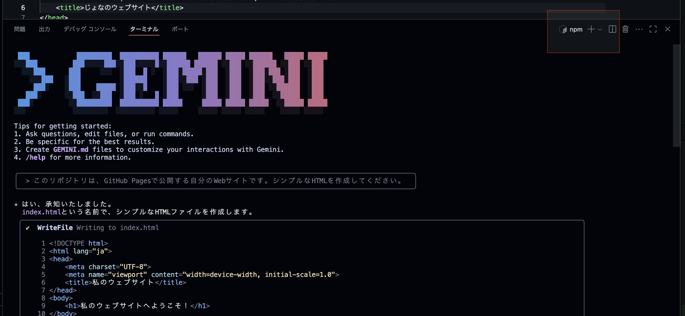

# Gemini CLIでWebサイトを作成する

Gemini CLIのインストールが完了したら、実際にWebサイトを作っていきましょう

## Geminiに依頼する

今後、Gemini CLIを起動した後の入力は、`user>`を先頭に付けて記述します。
```bash
user> ここにGeminiへのメッセージ、プロンプトが入ります。
```

では、早速GeminiにHTMLファイルを作ってもらいましょう
```bash
user> このリポジトリは、GitHub Pagesで公開する自分のWebサイトです。シンプルなHTMLを作成してください。
```


GeminiがHTMLファイルの内容を作成し、ユーザにファイル作成と変更の許可を求めます


```bash
1. Yes, allow once (今回のみ変更を許可する)
2. Yes, allow always (このセッション内でのHTMLファイルの作成と変更を常に許可する)
3. Modify with external editor (他のエディターでHTMLファイルを手動で変更する)
4. No, suggest changes (esc) (Geminiが提案した変更を却下し、別の変更内容をユーザーが提案する)
```

今回は 1. の`Yes, allow once`を選択しましょう。HTMLファイルが作成されます。

### ⚠️Gemini CLIの許可に関する注意点

実行するコマンドには十分注意してください。特に、`rm` や `rm -rf` などの削除系コマンドは、誤って重要なファイルを削除してしまう可能性があります。そのため、これらのコマンドに対しては `allow always` を選択しないことを**強くおすすめ**します。慎重に操作を行い、必要に応じて `allow once` を選択するようにしましょう。わからないコマンドが出てきたら、その都度`4. No, suggest changes`を選択し、そのコマンドがどのようなことをするのか、Gemini CLIに尋ねたりするのもよいでしょう。

## HTMLファイルを確認する

作成したHTMLページの内容を確認してみましょう。
ターミナルで以下のコマンドを入力してください。

```bash
python3 -m http.server 5500
```


**ブラウザーで開く** をクリックすると、現状のHTMLファイルが確認できます。
もしくはターミナル上の`http://0.0.0.:5500/`を、Macであれば⌘+クリック、WindowsであればCtrl+クリックで開くことができます。

このPythonコマンドでは簡易なWebサーバーを立ち上げ、今いるフォルダの中身をHTTPで配信しています。

---

# HTMLファイルをコミットする

Git では「**変更を記録する**」作業を *コミット* と呼びます。ここでは、Gemini CLI が作成した `index.html`を GitHub へアップロードするまでの流れを説明します。

まず、`git`コマンドを入力するために新しいターミナルのウィンドウを作成しましょう。（Gemini CLIの入力欄の先頭に`!`をつけることでもコマンド実行は可能です）

ターミナルの右上の「＋」を押します。



bashと表示されて新しい画面になったことを確認します。ここで以下のgitコマンドを入力していきます。


1. **変更内容を確認する**

   ```bash
   git status
   ```

   * 追加・更新されたファイルが赤字で表示されていれば OK です。
   * まだリポジトリを作成していない場合は `git init` で初期化しておきましょう。

2. **ステージに追加する**

   ```bash
   git add index.html        # 1 つだけ追加
   ```
   もしくは
   ```bash
   git add .                 # 現在のディレクトリ以下をまとめて追加
   ```

   `git status` をもう一度実行すると、追加したファイルが緑色に変わります。これで「コミット候補」になりました。

3. **コミットを作成する**

   ```bash
   git commit -m "Add initial index.html"
   ```

   * `-m` オプションで「*何をしたか*」を 1 行で書きます。
   * 後から見返すときに分かりやすいよう、内容を簡潔にまとめましょう。

4. **リモート（GitHub）へ反映（プッシュ）する**

   ```bash
   git push -u origin main
   ```

   * `-u` を付けておくと、次回以降は `git push` だけで済みます。

   * GitHub でリポジトリを開き、`index.html` がアップロードされていれば成功です。

### ここまでの流れのおさらい

```bash
git add .
git commit -m "Add initial site"
git push -u origin main
```

---

> **ポイント**
>
> * *add → commit → push* の 3 段階を覚えれば、基本操作はほぼカバーできます。
> * こまめなコミットは「戻れるポイント」を増やせるので、失敗しても安心です。

## Gemini CLIを使ってGit操作を行う

Git は **バージョン管理の“必修科目”** ですが、
毎回 `git add . → git commit → git push` を打つのは正直面倒です。
そこでGit操作にも Gemini CLI を使ってみましょう。

---

### 1行でpushまでを丸投げ

```bash
user> 変更を確認してpushしてください
```


`git status`という変更を確認するコマンドを実行しようとしています。`1. Yes, allow once`を選択し続行します。


その後Geminiの提案に従って`allow`していると、いつの間にかpushまで完了しています。

> **ポイント**
> Gemini CLI は *「ユーザーの意図 → 具体的な Git コマンド」* を橋渡ししてくれます。
> **コマンドの暗記やタイプミスに悩まされず、作業スピードも向上します**（が、最低限 add, commit, pushは覚えましょう）

---

### 使いこなしのヒント

1. **コミットメッセージも一緒に伝える**

   * 例: `user> 新しい About ページを追加したのでコミットしてください。`
2. **部分的に add したい場合**

   * 例: `user> blog ディレクトリだけ追加してコミット→push してください。`
3. **危険な操作は慎重に**

   * `force push` や `rm -rf` を伴うコマンドは、**必ず内容を確認**し、`allow once` に留めるのが安全です。

---

これで Git の日常的な “ルーチン作業” はほぼ Gemini CLI にお任せできます。
浮いた時間と集中力を **コンテンツの制作やデザインの改善** に充てましょう。

---

次へ → [GitHub Pages へデプロイ](./04-deploy-github-pages.md)
