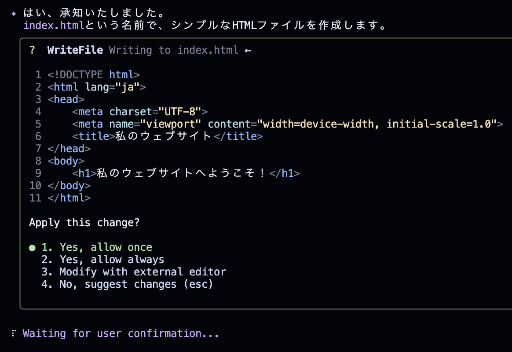

# Gemini CLIでWebサイトを作成する

Gemini CLIのインストールが完了したら、実際にWebサイトを作っていきましょう。

## Geminiに依頼する

Gemini CLIに対する入力と、ターミナル上で入力するコマンドを区別するため、今後、Gemini CLIに対する入力には`user>`を先頭に付けて記述します。
```bash
user> ここにGeminiへのメッセージ、プロンプトが入ります。
```

注: 上の `user>` は資料上の記法です。実際のGemini CLIには `user>` を付ける必要はありません。

では、早速GeminiにHTMLファイルを作ってもらいましょう。
```bash
user> このリポジトリは、GitHub Pagesで公開する自分のWebサイトです。シンプルなHTMLを作成してください。
```


Gemini CLIがHTMLファイルを作成すると同時に、以下のような表示が出てくると思います。
これは、Gemini CLIがコマンドを実行する際に、実行するコマンドについてユーザーに許可を求めています。



## Gemini CLIのコマンド実行時の確認と許可

Gemini CLIは、ファイルの作成・編集・削除など多くの操作を代わりに実行します。誤操作を防ぐため、実行前に「何をどう変えるか」を表示し、内容を確認してから許可を求めます。

```bash
1. Yes, allow once             # 今回の変更だけ実行する
2. Yes, allow always           # 同種の操作を、このセッション中は常に許可する
3. Modify with external editor # 外部エディターで自分で編集する
4. No, suggest changes (esc)   # 今回は実行せず、代案を提案する
```

通常は1の「Yes, allow once」を選ぶのが安全です。選択すると、表示された内容どおりにファイルが作成・更新されます。


*4. No, suggest changes (esc)を選択した時の様子。入力受付状態になり、Gemini CLIに対する変更を提案できます。*

### ⚠️許可を出す際の注意

削除系コマンド（`rm`、`rm -rf` など）は特に注意してください。これらに対しては、原則`allow always`を選ばないことを**強く推奨**します。内容に不安がある場合は`4. No, suggest changes`を選び、何をするコマンドかを尋ねるか、別案を提案しましょう。迷ったときは都度`allow once`を選ぶと安全です。

## HTMLファイルを確認する

作成したHTMLページの内容を確認してみましょう。
ターミナルで以下のコマンドを入力してください。

```bash
python3 -m http.server 5500
```


**ブラウザーで開く** をクリックすると、現状のHTMLファイルが確認できます。
もしくはターミナル上の`http://0.0.0.0:5500/`を、Macであれば⌘+クリック、WindowsであればCtrl+クリックで開くことができます。

このPythonコマンドでは簡易なWebサーバーを立ち上げ、今いるフォルダの中身をHTTPで配信しています。

【トラブルシュート】
- 5500番ポートが使用中なら `python3 -m http.server 5501` など別ポートに変更
- 「Open in Browser」が出ない場合は、VS Code（Codespaces）の「PORTS」タブから該当ポートを手動で開く
- 画面が更新されない時はファイル保存とブラウザのリロードを確認

---

# HTMLファイルをコミットする

Gitでは「**変更を記録する**」作業を*コミット*と呼びます。ここでは、Gemini CLIが作成した`index.html`をGitHubへアップロードするまでの流れを説明します。

まず、`git`コマンドを入力するために新しいターミナルのウィンドウを作成しましょう。（Gemini CLIの入力欄の先頭に`!`を付けることでもコマンド実行は可能です）

ターミナルの右上の「＋」を押します。


bashと表示されて新しい画面になったことを確認します。ここで以下の`git`コマンドを入力します。


1. **変更内容を確認する**

   ```bash
   git status
   ```

   * 追加・更新されたファイルが赤字で表示されていればOKです。
   * まだリポジトリを作成していない場合は`git init`で初期化しておきましょう。

2. **ステージに追加する**

   ```bash
   git add index.html        # 1つだけ追加
   ```
   もしくは
   ```bash
   git add .                 # 現在のディレクトリ以下をまとめて追加
   ```

   `git status`をもう一度実行すると、追加したファイルが緑色に変わります。これで「コミット候補」になりました。

3. **コミットを作成する**

   ```bash
   git commit -m "Add initial index.html"
   ```

   * `-m`オプションで「*何をしたか*」を1行で書きます。
   * 後から見返すときに分かりやすいよう、内容を簡潔にまとめましょう。

4. **リモート（GitHub）へ反映（プッシュ）する**

   ```bash
   git push -u origin main
   ```

   * `-u`を付けておくと、次回以降は`git push`だけで済みます。

   * GitHubでリポジトリを開き、`index.html`がアップロードされていれば成功です。

### ここまでの流れのおさらい

```bash
git add .
git commit -m "Add initial site"
git push -u origin main
```

---

> **ポイント**
>
> * *add → commit → push* の3段階を覚えれば、基本操作はほぼカバーできます。
> * こまめなコミットは「戻れるポイント」を増やせるので、失敗しても安心です。

## Gemini CLIを使ってGit操作を行う

Gitは **バージョン管理において必ず覚えておきたい操作** ですが、
毎回 `git add . → git commit → git push` して、毎回コミットメッセージを書くのも正直面倒です。
そこで、Git操作にもGemini CLIを使ってみましょう。

---

### 1行でpushまでを丸投げ

```bash
user> 変更を確認してpushしてください
```


`git status`という変更を確認するコマンドを実行しようとしています。`1. Yes, allow once`を選択し続行します。


その後、Geminiの提案に従って`allow`していくと、簡単にpushまで完了できます。

> **ポイント**
> Gemini CLIは*「ユーザーの意図 → 具体的なGitコマンド」*を橋渡ししてくれます。
> **コマンドの暗記やタイプミスに悩まされず、作業スピードも向上します**（が、最低限add、commit、pushは覚えましょう）

これで Git の日常的な “ルーチン作業” はほぼ Gemini CLI にお任せできます。
浮いた時間と集中力を **コンテンツの制作やデザインの改善** に充てましょう。

---

次へ → [GitHub Pages へデプロイ](./04-deploy-github-pages.md)
目次へ → [ホーム](./index.md)
