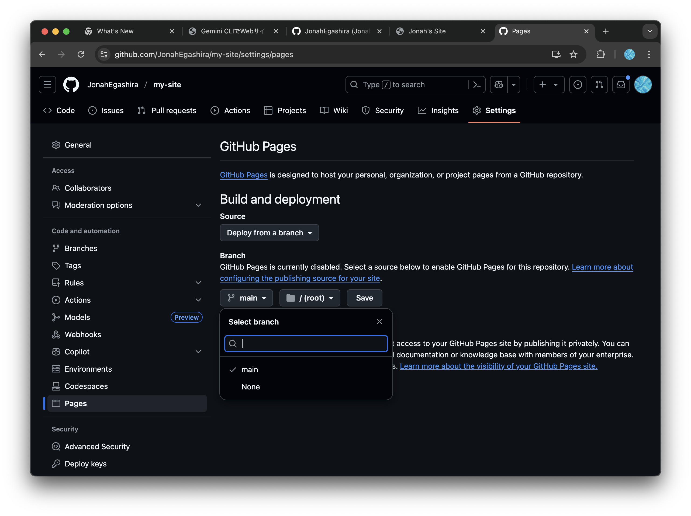
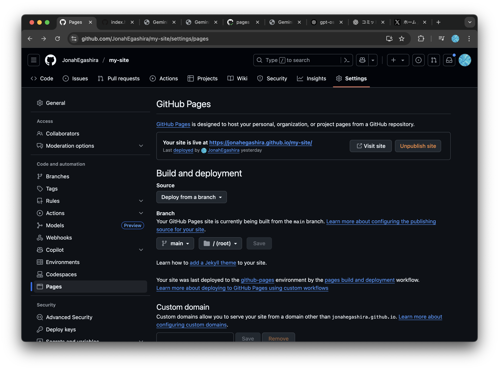
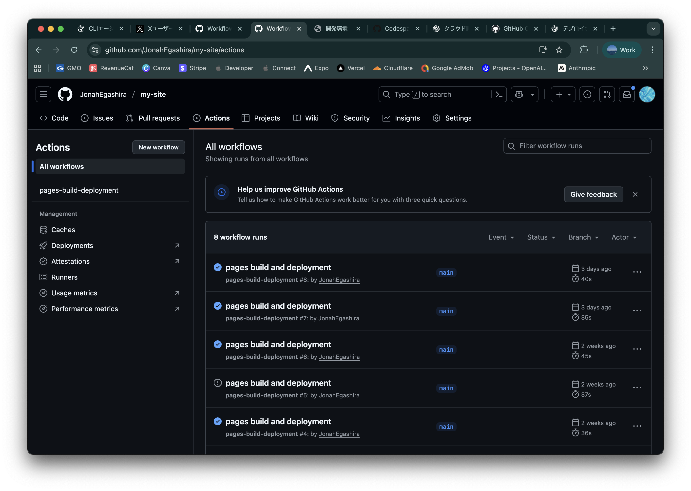
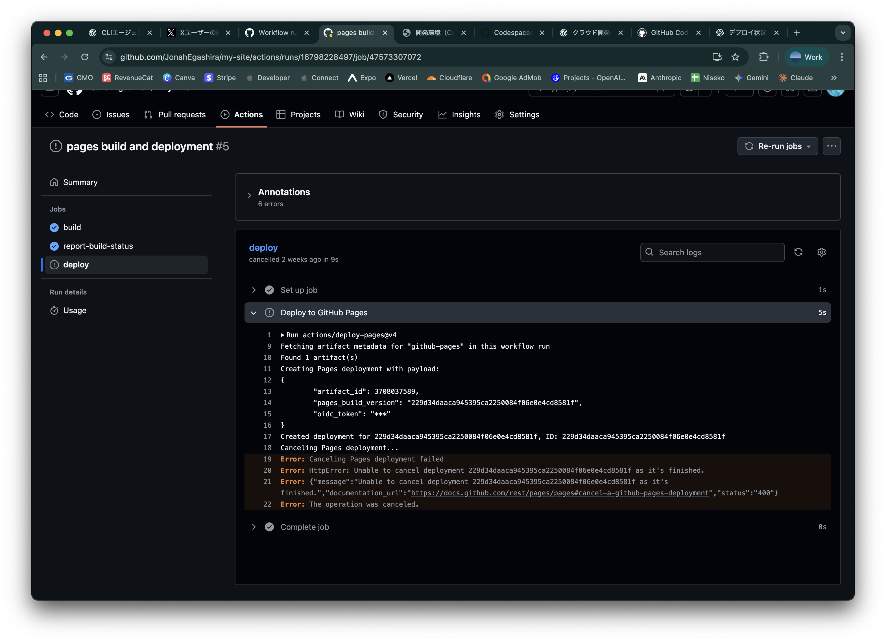

# GitHub Pagesを使ってデプロイ

サイトの内容を増やしたり、見た目を豪華にするのは後々に取り組むとして、作成したHTMLファイルをWeb上に公開してみましょう。サイトの公開にはGitHub Pagesを利用します。

## GitHub Pagesとは

GitHub Pagesは、GitHubが提供するサービスで、簡単にWebサイトを公開できる場所です。GitHubに保存したHTML、CSS、JavaScriptのファイルを使って、無料でWebサイトを公開できます。

### デプロイとは

デプロイ（Deploy）とは、開発したアプリケーションやWebサイトを実際にユーザーがアクセスできる環境に配置することを指します。GitHub Pagesを使うと、リポジトリにあるコードを簡単にWeb上に公開（デプロイ）することができます。

## GitHub Pagesを使ったデプロイ手順

デプロイ手順は非常に簡単です。すでにステップ1と2は完了しています。

1. **GitHubリポジトリを準備**
   - デプロイしたいプロジェクトのリポジトリをGitHub上に作成します。（今回は作成済みの`my-site`リポジトリです）

2. **リポジトリにコードをpush**
   - ローカルで作成したHTML、CSS、JavaScriptファイルをリポジトリにpushします（すでにpush済みです）

3. **GitHub Pagesの設定**
   - リポジトリのページに移動し、右上の「Settings」をクリックします。
   - 左側のメニューから「Pages」を選択します。
   

4. **公開するブランチを選択**
   - 「Source」セクションで、公開したいブランチ（通常は`main`）を選択します。
   - 「Save」をクリックして設定を保存します。
   

💡 ブランチとは？

   **ブランチ（Branch）** とは、Gitで管理されているプロジェクトの「作業の流れ」を分岐させる仕組みです。

   ### ブランチのイメージ
   
   - **木の枝のように分岐**：メインの開発ライン（通常は`main`ブランチ）から枝分かれして、独立した作業ができます
   - **並行作業が可能**：複数人で違う機能を同時に開発したり、実験的な変更を安全に試せます

   
   *出典：[DevDojo - Git Branches Guide](https://devdojo.com/guide/git/git-branches)*

   ### 主なブランチの種類
   
   - **`main`ブランチ**：プロジェクトのメインとなるブランチ。通常はここに最終的なコードが置かれます。
   - **`develop`ブランチ**：開発中のコードが置かれるブランチです。
   - **機能ブランチ**：特定の機能を開発するための一時的なブランチです。
   
   ### なぜブランチを使うのか
   
   1. **安全性**：メインのコードを壊すリスクなく、新機能を試せます。
   2. **整理整頓**：機能ごとに作業を分けて、変更履歴を見やすくできます。
   3. **チーム作業**：複数人が同時に違う作業をしても衝突しません。
   
   GitHub Pagesでは、どのブランチのコードを公開するかを選択できます。通常は安定した`main`ブランチを選択します。

   

5. **サイトの公開を確認**
   - 設定が完了すると、GitHub PagesのURLが表示されます。このURLをクリックすると、公開されたWebサイトを確認できます。
   **Your site is live at [url]** の部分です。
   

これで、GitHub Pagesを使ってプロジェクトをデプロイすることができます。公開されたサイトは、GitHubリポジトリの更新に応じて自動的にアップデートされます。

## デプロイ状況の確認

Webページに変更を加えてpushした後、何らかの理由でデプロイできていないことがあります。
デプロイ状況の確認は上部の`Actions`タブから行えます。

青い☑️マークが付いていればデプロイに成功しています。赤い❌マークが付いているときは失敗しているので、該当のデプロイをクリックし、ログを開いてエラーを確認しましょう。

（例）デプロイを途中でキャンセルしてエラーが出ている状態

しかし、デプロイの失敗の原因を特定するには慣れや経験が必要なことも多いです。どこかで詰まったら、周りの詳しい人や講師に確認してみてください。

---

## よくあるつまずき（チェックリスト）
- 設定直後は反映に1〜3分かかることがあります（5分待っても出ない場合はActionsを確認）
- PagesのSource: `Deploy from a branch`／Branch: `main`／Folder: `/ (root)` を選んでいるか
- 404が出るときは、リポジトリ直下に `index.html` があるか確認（サブフォルダーに置いていないか）
- リポジトリをPrivateにしている場合、Pagesの公開可否や可視性に注意（学習用はPublic推奨）

次へ → [CSS/JavaScript で拡張](./05-style-and-js.md)
目次へ → [ホーム](./index.md)
