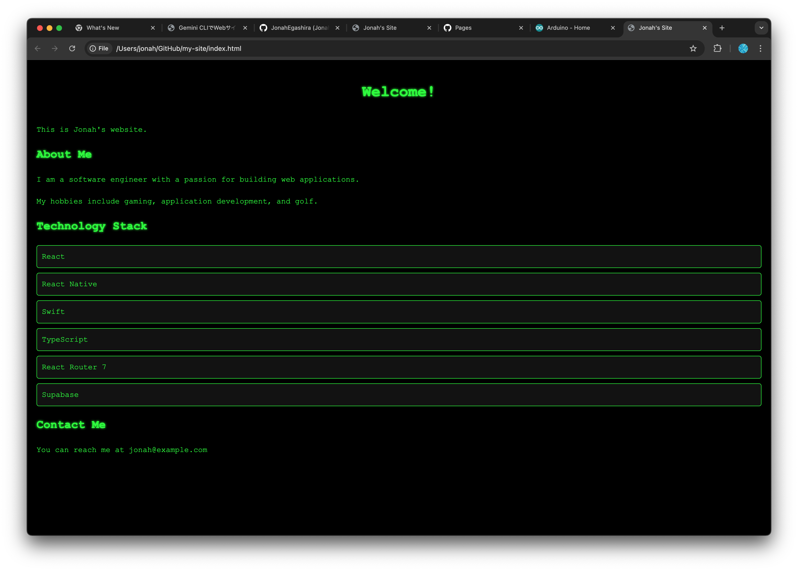
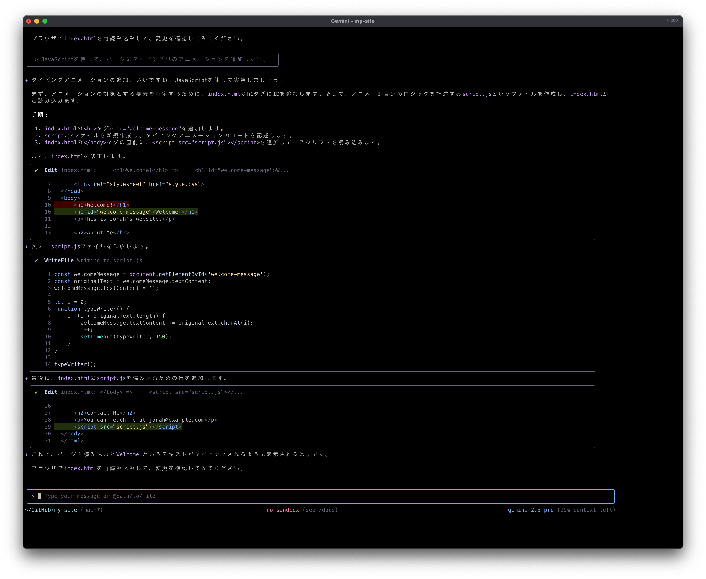

# CSS, JavaScriptでウェブサイトを充実させる

HTMLファイルだけのウェブサイトでは見た目が寂しいので、内容と見た目を改善しましょう
まずはGemini CLIを使って（もしくは手動で）、HTMLのコンテンツを増やします。

```bash
user> index.htmlを自己紹介ページにしたいです。私があなたの質問に答えるので、その内容を元にページのコンテンツを作って。
```


Gemini CLIがどんな内容を追加したいか聞いてくるので、対話しながらページの内容を決めてください

<details markdown="1"><summary>💡 Gemini CLIが表示するedit画面について</summary>

Gemini CLIがファイルの内容を変更する時、緑を赤で表示されるDiffがユーザに提示されます。
**Diff（差分）表示** とは、ファイルの変更内容を視覚的に表示する方法です。

### 🔍 Diffの見方

- **緑色の行（+で始まる）**：新しく追加された内容
- **赤色の行（-で始まる）**：削除された内容
- **白色の行**：変更されていない内容


</details>

このDiffの表記はGitなどのバージョン管理システムでよく使用されます。

## CSSを追加する

### CSSとは
CSS（Cascading Style Sheets）は、ウェブページの見た目を良くするための言語です。CSSを使うと、文字の色やフォント、背景色、レイアウトなどを簡単に変えられます。HTMLがページの骨組みを作るのに対し、CSSはその見た目を整えます。これにより、内容とデザインを分けて管理できるので、ウェブサイトを効率よく作れます

### Gemini CLIでCSSを追加してページの見た目を整える

```bash
user> index.htmlの見た目をよくするために、cssファイルを追加して、スタイリングを行なってください。
```


Gemini CLIが、`style.css`ファイルを作成し、スタイルを記述するコードを生成していることが確認できます
また、`index.html`でそのcssファイルを読み込んでスタイルを適用させるために、htmlファイルも編集を加えています

変更を加えたらターミナル上で`python3 -m http.server 5500`を実行してブラウザ上で変更を確認してみましょう。
内容が変化していない場合は、ファイルがちゃんと保存されているかどうかを確認し、ブラウザのページを再読み込みしたりしましょう。


シンプルな白黒の見た目から、少し豪華になりました

Gemini CLIと対話して、好きなスタイルを作ってみましょう

## CSSスタイルのアイデア例

```bash
user> ハッカー風の画面にして。
```



```bash
user> 8bitゲーム風のレトロなデザインにしてください。
```


```bash
user> どうぶつの森風の可愛いデザインにしてください。
```


## JavaScriptを追加する

### JavaScriptとは
JavaScriptは、ウェブページに動的な機能を追加するためのプログラミング言語です。ユーザーの操作に応じてページの内容を変更したり、アニメーションを追加したり、データを処理したりすることができます。HTMLとCSSがウェブページの構造と見た目を担当するのに対し、JavaScriptはインタラクティブな要素を提供します

JavaScriptを使うことで、ユーザーの入力に応じたリアルタイムのフィードバックや、ページの一部を動的に更新することが可能になります。これにより、よりリッチでユーザーフレンドリーなウェブ体験を提供できます

Gemini CLIを使って、JavaScriptを追加し、ページにインタラクティブな要素を加えてみましょう

```bash
user> JavaScriptを使って、ページにタイピング風のアニメーションを追加したい。
```




自分好みのアニメーションや機能を実装してみましょう

```bash
user> 上から数字が降ってきて、ハリウッドのハッカー映画みたいなページにして欲しい。
```


- 変更をしたらこまめに`add`, `commit`をして、区切りが付いたら`push`してデプロイ先に反映させましょう

## ライブラリを使って見た目を豪華にする

ライブラリは、よく使う機能を“使い回しやすい形”にまとめたコード集です。
素のJavaScript（ブラウザ標準APIだけ）でも何でも作れますが、毎回ゼロから書く手間や細かな下回り（描画初期化・座標変換・3D行列計算・アニメーションループ作成など）がかかります。ライブラリはここを代わりにやってくれるので、表現やロジックに集中できます。

### p5.js

p5.jsはクリエイティブコーディング向けの2Dライブラリです。

```bash
user> p5.jsを使って、ブラウザ画面上にparticleが複数動いていて、particle同士が近いたときに線で繋がるようなアニメーションのページを作成して。　
```


### three.js

three.jsは同じくクリエイティブコーディング向けで、3Dライブラリです。WebGLの複雑さを隠し、シーン・カメラ・ライト・メッシュといった3Dの基本要素を簡単に扱えます。


```bash
user> three.jsを使って、ブロックが上からピラミッド上に積み重なっていくアニメーションを作成して。ブロックはカラフルにお願いします。
```


---

次へ → [Tips・検索・画像添付](./06-tips-and-tricks.md)
