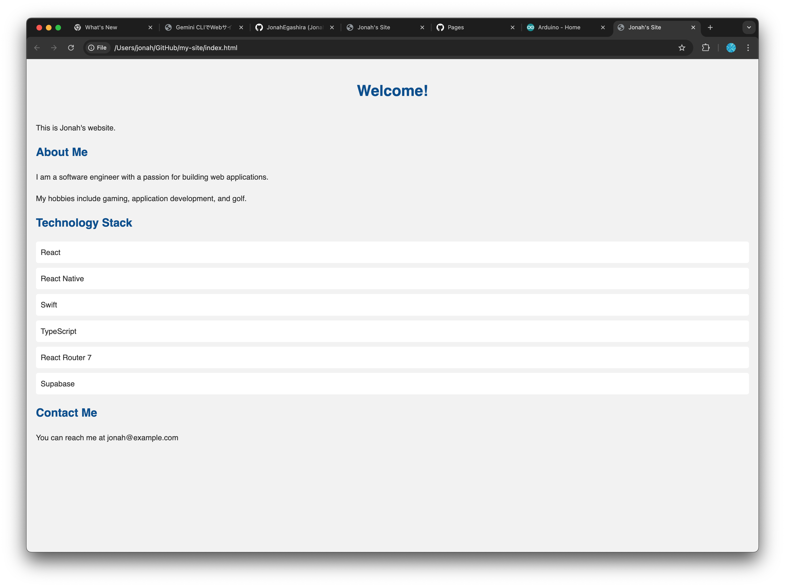

# CSS、JavaScriptでWebサイトをアップグレード

## 1. HTMLでコンテンツを増やす

HTMLファイルだけのWebサイトでは見た目が寂しいので、内容と見た目を改善しましょう。
まずはGemini CLIを使って（もしくは手動で）、HTMLのコンテンツを増やします。

```bash
user> index.htmlを自己紹介ページにしたいです。私があなたの質問に答えるので、その内容を基にページのコンテンツを作って。
```


Gemini CLIがどんな内容を追加したいのか聞いてくるので、対話しながらページの内容を決めてください。

<details markdown="1"><summary>💡 Gemini CLIが表示する編集画面（Diff）について</summary>

Gemini CLIがファイルの内容を変更するとき、緑や赤のハイライトで表示される差分（Diff）がユーザーに提示されます。
**Diff（差分）表示**とは、ファイルの変更内容を視覚的に表示する方法です。

### 🔍 Diffの見方

- **緑色の行（+で始まる）**：新しく追加された内容
- **赤色の行（-で始まる）**：削除された内容
- **白色の行**：変更されていない内容


</details>

このDiffの表記はGitなどのバージョン管理システムでよく使用されます。

## 2. CSSを追加する

### CSSとは
CSS（Cascading Style Sheets）は、見た目を定義する言語です。CSSを使うと、文字の色やフォント、背景色、レイアウトなどを簡単に変えられます。HTMLがページの骨組みを作るのに対し、CSSはその見た目を整えます。

### Gemini CLIに頼んでCSSを追加する

```bash
user> index.htmlの見た目をよくするために、CSSファイルを追加して、スタイリングを行ってください。
```


Gemini CLIが、`style.css`ファイルを作成し、スタイルを記述するコードを生成していることが確認できます。
また、`index.html`でそのCSSファイルを読み込んでスタイルを適用するために、HTMLファイルにも編集を加えています。

変更を加えたら、ターミナル上で`python3 -m http.server 5500`を実行してブラウザー上で変更を確認してみましょう。
内容が変化していない場合は、ファイルがきちんと保存されているかどうかを確認し、ブラウザーのページをリロードしましょう。



シンプルな白黒の見た目から、少し豪華になりました。

Gemini CLIと対話して、好きなスタイルを作ってみましょう。

## CSSスタイルのアイデア例

```bash
user> ハッカー風の画面にして。
```


```bash
user> 8ビットゲーム風のレトロなデザインにしてください。
```


```bash
user> どうぶつの森風の可愛いデザインにしてください。
```


## 3. JavaScriptを追加する

### JavaScriptとは
JavaScriptは、Webページに動的な機能を追加するためのプログラミング言語です。ユーザーの操作に応じてページの内容を変更したり、アニメーションを追加したり、データを処理したりすることができます。HTMLとCSSがWebページの構造と見た目を担当するのに対し、JavaScriptはインタラクティブな要素を提供します。

Gemini CLIを使って、JavaScriptを追加し、ページにインタラクティブな要素を加えてみましょう。

```bash
user> JavaScriptを使って、ページにタイピング風のアニメーションを追加したい。
```


自分好みのアニメーションや機能を実装してみましょう。

```bash
user> 上から数字が降ってきて、ハリウッドのハッカー映画みたいなページにしてください。
```


JavaScriptを使うと、スペースキーでジャンプするゲームなどを作ることもできます。

```bash
user> Flappy Birdを作ってください。スペースキーでジャンプするように作ってください。
```


- 変更をしたらこまめに`add`、`commit`を行い、区切りがついたら`push`してデプロイ先に反映させましょう。

<details markdown="1">
<summary>より詳しくHTML、CSS、JavaScriptの関係を理解しよう</summary>

## HTML、CSS、JavaScriptの関係を理解しよう

Webページは**HTML、CSS、JavaScript**の3つの技術が協力して動いています。それぞれの役割と、どのように連携しているかを見ていきましょう。

### Webページの3層構造

Webページは、建物のように3つの層で構成されています：

1. **HTML（構造層）** - 建物の骨組み
2. **CSS（表現層）** - 内装や外装のデザイン  
3. **JavaScript（振る舞い層）** - 電気設備やエレベーターなどの動く仕組み

### 📝 HTML：ページの骨組み

HTMLは、Webページの**構造と内容**を定義します。

```html
<!DOCTYPE html>
<html>
<head>
    <title>私のページ</title>
</head>
<body>
    <h1>こんにちは</h1>
    <p>これは段落です</p>
    <button>クリックして</button>
</body>
</html>
```

**役割：**
- テキスト、画像、ボタンなどのコンテンツを配置
- ページの階層構造を定義
- 他のファイル（CSS、JavaScript）への参照を含む

### CSS：見た目のデザイン

CSSは、HTMLで作った構造に**スタイル（見た目）**を適用します。

```css
h1 {
    color: blue;
    font-size: 32px;
}

button {
    background-color: green;
    padding: 10px;
}
```

**役割：**
- 色、フォント、サイズを設定
- レイアウトや配置を調整
- アニメーション効果を追加

### JavaScript：動きと対話

JavaScriptは、ページに**動的な機能**を追加します。

```javascript
document.querySelector('button').addEventListener('click', function() {
    alert('ボタンがクリックされました！');
});
```

**役割：**
- ユーザーの操作に反応
- ページの内容を動的に変更
- データの処理と計算

### どのように連携するか

#### 1. HTMLがCSSとJavaScriptを読み込む

```html
<!DOCTYPE html>
<html>
<head>
    <!-- CSSファイルを読み込む -->
    <link rel="stylesheet" href="style.css">
</head>
<body>
    <h1>私のページ</h1>
    
    <!-- JavaScriptファイルを読み込む -->
    <script src="script.js"></script>
</body>
</html>
```

#### 2. 読み込みの流れ

```
1. ブラウザーがHTMLファイルを読み込む
   ↓
2. <link>タグを見つけたらCSSファイルを読み込む
   ↓
3. CSSのスタイルをHTMLの要素に適用
   ↓
4. <script>タグを見つけたらJavaScriptファイルを読み込む
   ↓
5. JavaScriptが実行され、ページが動的になる
```

### 実例：ボタンをクリックして色を変える

この例では、3つの技術がどのように協力するかを示します：

**index.html**
```html
<!DOCTYPE html>
<html>
<head>
    <link rel="stylesheet" href="style.css">
</head>
<body>
    <div id="box">クリックで色が変わるボックス</div>
    <button id="colorBtn">色を変える</button>
    
    <script src="script.js"></script>
</body>
</html>
```

**style.css**
```css
#box {
    width: 200px;
    height: 100px;
    background-color: lightblue;
    padding: 20px;
    text-align: center;
}

#colorBtn {
    margin-top: 10px;
    padding: 10px 20px;
    cursor: pointer;
}
```

**script.js**
```javascript
document.getElementById('colorBtn').addEventListener('click', function() {
    const box = document.getElementById('box');
    box.style.backgroundColor = 'lightgreen';
});
```

### それぞれの特徴まとめ

| 技術 | 役割 | ファイル拡張子 | 書く場所 |
|------|------|--------------|----------|
| HTML | 構造・内容 | .html | `<body>`内 |
| CSS | デザイン・見た目 | .css | `<style>`タグ内 または 外部ファイル |
| JavaScript | 動作・機能 | .js | `<script>`タグ内 または 外部ファイル |

### 覚えておくべきポイント

1. **HTMLが基本** - 必ずHTMLから始まり、CSSとJavaScriptはHTMLから読み込まれる
2. **CSSは見た目だけ** - HTMLの構造を変えずに、見た目だけを変更
3. **JavaScriptは万能** - HTMLの構造もCSSのスタイルも、JavaScriptから変更可能
4. **読み込み順序が重要** - 特にJavaScriptは、操作したいHTML要素の後に読み込む

この3つの技術を組み合わせることで、静的なドキュメントから、美しくインタラクティブなWebアプリケーションまで、あらゆるWebページを作ることができます。

</details>

## 4. ライブラリを使ってより表現力を上げる

ライブラリは、よく使う機能や処理を“使い回しやすい形”にまとめたコード集です。
素のJavaScript（ブラウザー標準APIだけ）でも何でも作れますが、毎回ゼロから書く手間がかかります。ライブラリを使用することで、表現やロジックに集中できます。

### p5.js

p5.jsはクリエイティブコーディング向けの2Dライブラリです。

```bash
user> p5.jsを使って、ブラウザー画面上にパーティクルが複数動き、パーティクル同士が近いときに線でつながるアニメーションのページを作成して。
```


### three.js

three.jsは同じくクリエイティブコーディング向けで、3Dライブラリです。WebGLの複雑さを隠し、シーン・カメラ・ライト・メッシュといった3Dの基本要素を簡単に扱えます。


```bash
user> three.jsを使って、ブロックが上からピラミッド上に積み重なっていくアニメーションを作成して。ブロックはカラフルにお願いします。
```


ここで紹介したページのアイデアの例は[こちら](https://jonahegashira.github.io/my-site/)にあります。
このページもGemini CLI + GitHub Pagesで作成されています。

---

前へ → [GitHub Pagesへデプロイ](./04-deploy-github-pages.md)
次へ → [Tips・検索・画像添付](./06-tips-and-tricks.md)
目次へ → [ホーム](./index.md)
