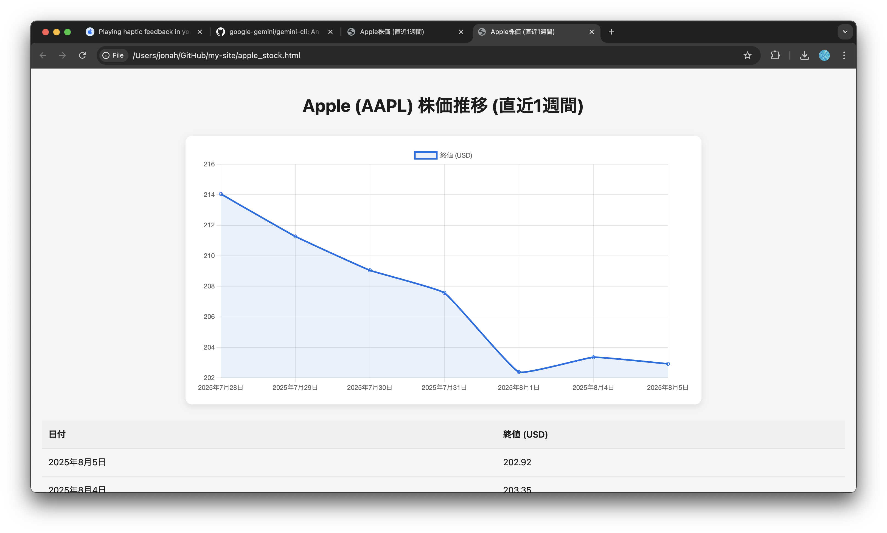
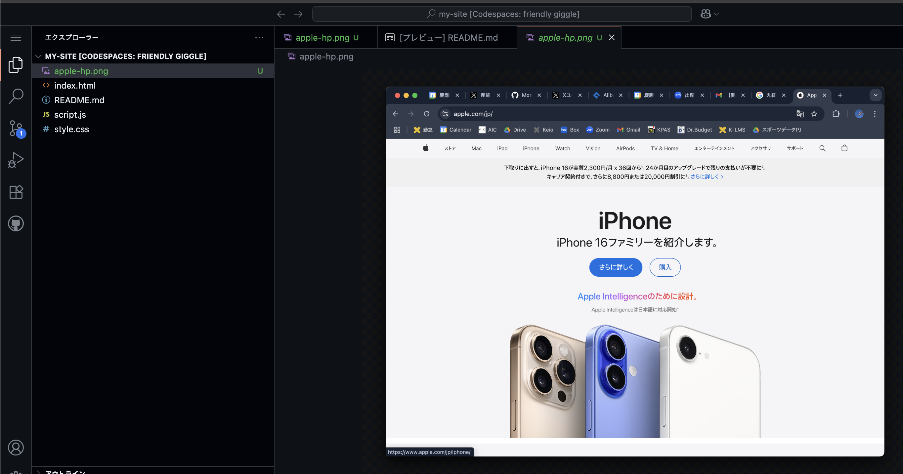
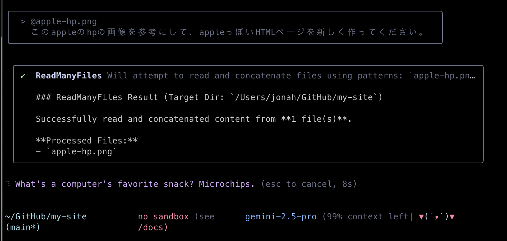
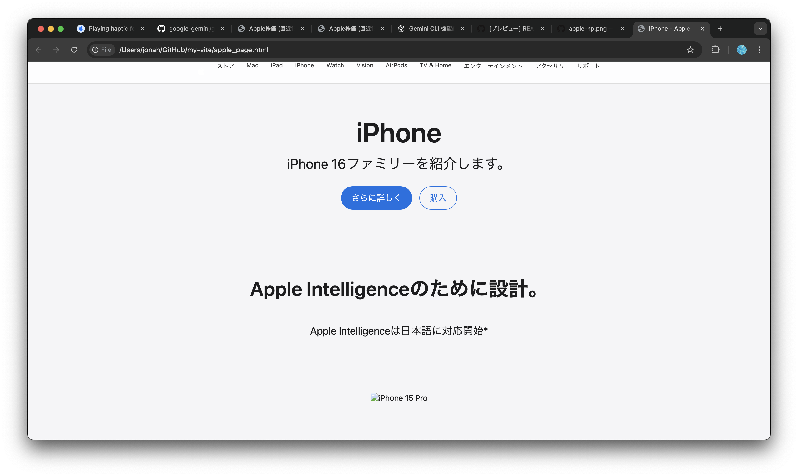
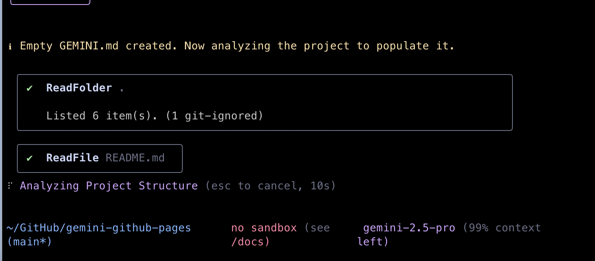

# Gemini CLI Tips

Gemini CLIは複数の機能を実行できるAIエージェントなので、Webサイトを構築する以外にも、数多くのことができます。詳細は[公式GitHub](https://github.com/google-gemini/gemini-cli)をご覧ください。ここでは便利な機能をいくつか紹介します。

## Web検索

Gemini CLIは、Web検索機能を通じてインターネット上の情報を取得し、要約やファイル生成まで行えます。

```bash
user> 直近1週間のAppleの株価を検索して、推移を新しいHTMLファイルに載せてください。 
```



## ファイル（画像）添付

Gemini CLIに画像を含むファイルを読み込ませて、そのファイルの内容を解析してもらったり、参考画像をもとにWebページのデザインを行うこともできます。

画像を添付するには、Gemini CLIの入力エリアに`@ファイルへのパス`を入力します。

パス（path）とは、コンピューター上でファイルやフォルダがどこにあるかを示す「住所」のようなものです。

ここではAppleのWebページのスクリーンショットを撮り、その画像をGemini CLIに渡して再現してみます。

<details>
<summary>💡 パス（path）を理解しよう</summary>

> **パス = ファイルやフォルダまでの"道順"**
> パソコンの中で目的地を示す住所のようなものです。

- 絶対パスと相対パス

| 種類       | いつ使う？                           | 例（macOS/Linux）                                   | 例（Windows）                                         |
| -------- | ------------------------------- | ------------------------------------------------ | -------------------------------------------------- |
| **絶対パス** | ファイルの場所を"地球規模"で一意に示したいとき        | `/Users/jonah/projects/my-site/images/apple-hp.png` | `C:\\Users\\jonah\\projects\\my-site\\images\\apple-hp.png` |
| **相対パス** | 今いるフォルダ（カレントディレクトリ）からの距離で示したいとき | `./images/apple-hp.png`                             | `.\\images\\apple-hp.png`                             |

* `./` は "今いる場所"
* `../` は "ひとつ上の階層"

</details>

---

Appleのページのスクリーンショットを撮り、`apple-hp.png`などの名前でCodespacesのファイルエクスプローラーエリアに追加します。



Gemini CLIに`@`と入力すると、添付するファイルの候補が出てくるので、`@apple-hp.png`を選択します。その状態で、この画像に対して行いたいリクエストを入力します。

```bash
user> @apple-hp.png このAppleのホームページの画像を参考にして、AppleっぽいHTMLページを新しく作ってください。
```



すると、画像を読み込んだGemini CLIがAppleのページに近いデザインを作成してくれます。iPhoneの画像などは準備していないので表示していませんが、ボタンやヘッダーの見た目はかなり近いのではないでしょうか。



---
# Gemini CLIコマンド

Gemini CLIとの対話画面で`/`から始まるコマンドを入力することで便利な機能を利用できます。
ここではその中からいくつかを紹介します。


## `/compress`

ChatGPTやGeminiなどの大規模言語モデル（LLM）は、会話が長くなるほど過去の文脈を保持するコストが増え、性能が下がることがあります。

そこで **Gemini CLI** には「会話の要約」機能があり、長くなった会話を自動でまとめ直して、以降はその要約を文脈として使うことで、コンテキストが無限に膨らむのを防いでいます。

さらに、この要約は自動で行われるだけでなく、**ユーザーがコマンドを入力して好きなタイミングで実行**することもできます。

`/compress` を使うと「今までの会話を一度きれいにまとめ直して、そこから続けられる」便利なコマンドです。

## `/init`

`/init` は、既存のプロジェクトでGemini CLIを導入する際の初期設定コマンドです。

### 主な機能

`/init` を実行すると、以下の処理が自動的に行われます：

1. **ファイルの自動読み込み**  
   実行したフォルダ内のすべてのファイルをGeminiが自動的にスキャンします。

2. **プロジェクト分析**  
   読み込んだファイルからプロジェクトの構造と概要を理解します。

3. **仕様書の自動生成**  
   `GEMINI.md`というドキュメントファイルを作成し、プロジェクトの仕様を記録します。

初期設定を完了すると、その後のGemini CLIとの対話がスムーズになります。Geminiは毎回`GEMINI.md`を参照してからコードの実装や修正を行うため、プロジェクトの文脈を理解した上で的確な提案ができるようになります。



## `/clear`

それまでの文脈とは全く異なる新しい機能や変更を行う場合、以前の会話履歴を消去し、一から新たな会話を始める`/clear`コマンドが便利です。

会話が長くなってきたときに、以前の会話の内容を引き継いで実装を続けたり、以前の会話の内容と関連した実装を行う場合には`/compress`を、全く新しい内容を始めたいときは`/clear`するとよいでしょう。

## まとめ

この講習会では、Gemini CLIを使用してGitHub Pages上にWebサイトを構築する方法を学びました。以下に主要なポイントをまとめます：

- **Gemini CLIの活用**: Gemini CLIを使って、コード生成や修正、文章作成を効率的に行う方法を学びました。
- **GitとGitHubの基礎**: バージョン管理システムであるGitの基本操作と、GitHubを使ったプロジェクトの管理・共有方法を理解しました。
- **Webサイトのスタイリング**: CSSを用いてWebサイトの見た目を改善し、より魅力的なデザインを実現しました。
- **JavaScriptの導入**: JavaScriptを使って、Webページに動的な機能を追加し、インタラクティブな要素を提供する方法を学びました。

これらのスキルを活用して、さらに高度なWebサイトを構築し、公開することができます。Gemini CLIとともに、あなたの創造力を活かして楽しいWebページを制作しましょう。

---

目次へ → [ホーム](./index.md)
