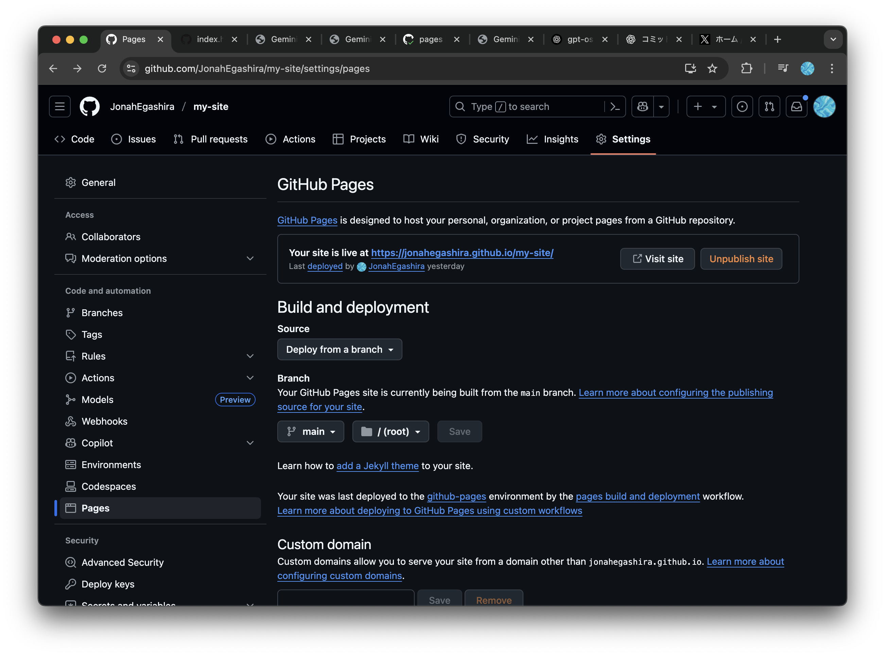
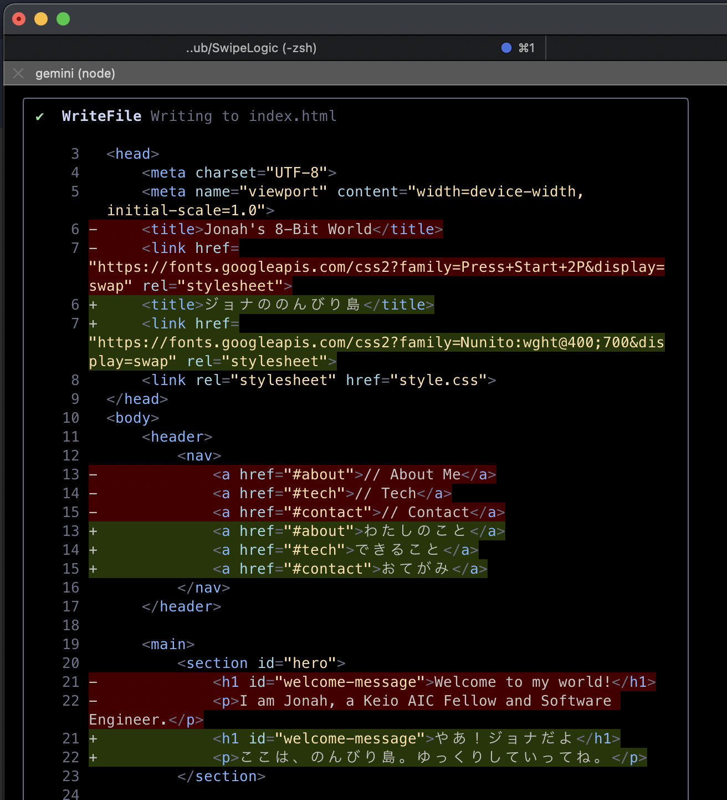
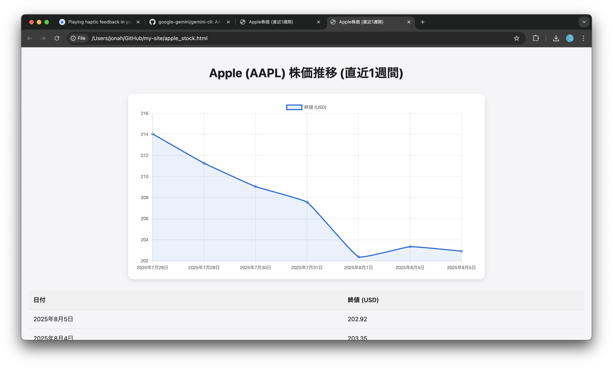
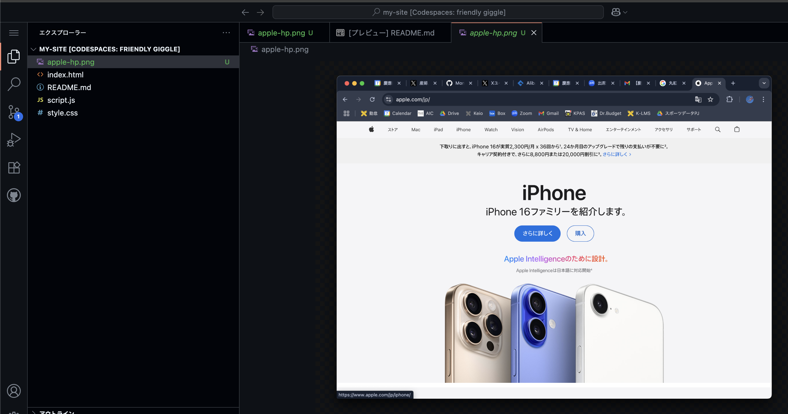
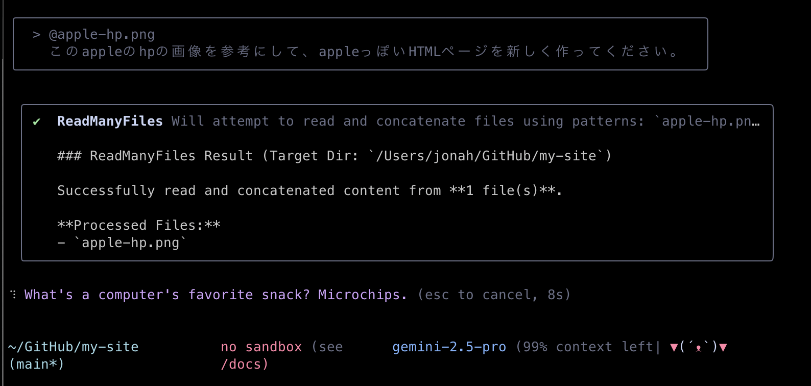

# Gemini CLIでWebサイトをつくろう

# はじめに

### 目的

- AIエージェントであるGemini CLIを用いて、GitHub Pages上にサイトを構築する方法を学び、実際に公開する

### 得られるもの

- Gemini CLIの導入方法と使い方
- Gitの基礎の操作、GitHubの使い方
- VSCode(GitHub Codespaces)の使い方
- HTML, CSS, Java Scriptを使ったWebサイト作成の方法

### 得られないもの

- HTML, CSS, Java Scriptの詳細な文法
- Geminiなどの言語モデル自体の理論

### 進め方

- わからないことは積極的に近くの人やChatGPT, Geminiに聞きましょう
- すでにGit, GitHubに慣れていたりする人はどんどん進めて構いません。周りの人が困っていたら助けてあげましょう
- 講義スライドはありません。このWebページの内容を元に進めます

## Gemini CLIとは

- Googleが提供するオープンソースのAIエージェントです。
- ターミナル上でGeminiモデルを利用してコード生成・修正、文章作成など、複数の作業を自然言語で操作可能です

# GitHubアカウントを作成しよう

Web サイトを公開したり、開発を行う上では **GitHub アカウント** があると便利です

1. ブラウザで [https://github.com](https://github.com) を開く  
2. 右上の **Sign up** をクリック  
3. メールアドレス・ユーザー名・パスワードを入力し、画面の指示に従って登録  
4. 登録が完了すると、あなたの **GitHub プロフィールページ** が表示されます


## GitとGitHubとは

### Git
- **バージョン管理システム**の一つです
- ファイルの変更履歴を記録し、過去の状態に戻したり、変更内容を確認できます
- 例：文書、プログラムを書いていて「さっき作業していたバージョンに戻したい」というときなどに便利です

### GitHub
- Gitを使ったプロジェクトを**インターネット上で管理・共有**できるサービスです
- 世界中の開発者が利用している最大級のプラットフォームです
- 無料でWebサイトを公開できる「GitHub Pages」機能があります

### Git, GitHubが使われる理由
1. **失敗しても安心** - いつでも前の状態に戻せます
2. **共同作業が簡単** - 複数人で同じプロジェクトを編集できます
3. **無料でWebサイト公開** - GitHub Pagesで自分のサイトを世界に公開できます

---

# 3. 開発環境の準備

本講義中は、GitHub Codespacesを用いてGemini CLIを利用します。GitHub Codespacesは、クラウド上で開発環境を提供するサービスで、ブラウザだけで開発環境を利用できます。これにより、インストールやセットアップの手間を省き、すぐに開発を始めることができます。

| 選択肢 | 特長 | モチベーション |
|--------|------|--------------------|
| **GitHub Codespaces** | ◎ インストール不要<br/>◎ ブラウザだけで完結<br/>◎ 社用 PC でも OK | Gemini CLIだけとりあえず使ってみたい / セットアップを短時間で終わらせたい |
| **ローカルセットアップ** | ◎ 自分のPC上でAIエージェントが動く<br/>◎ ターミナル学習に最適 | コマンド操作を学びたい / 今後も本格的に開発をしてみたい |

---

# **GitHub Codespaces とは？**

* **クラウド上にあるパソコン**を、あなた専用の開発用に用意してくれるサービスです。
* 実際のパソコンは触らず、**インターネット経由でアクセス**して使います。

* **環境構築不要**
  自分のPCに何もインストールしなくても、すぐ開発を始められます。
* **どのPCでも同じ環境**
  チーム全員が同じ設定で作業できる

---

💡 例えるなら：

> 「自分専用のプログラミング用パソコンを、GitHub がクラウド上に貸してくれるサービス」
> 必要なときだけ呼び出して、終わったら閉じる感じです。

---

## GitHub Codespacesでの作業手順

まずはじめにGitHubでリポジトリを作成しましょう

### GitHub リポジトリを新規作成

- リポジトリとは、Gitで管理しているフォルダ、ディレクトリのことです。

<details markdown="1">
<summary>補足：💡フォルダ、ディレクトリ、リポジトリの違い</summary>

### **📦 フォルダ**

* パソコンの中でファイルを入れる「入れ物」
* 物理的なディレクトリ構造の見た目のこと

---

### **📂 ディレクトリ**

* フォルダとほぼ同じ意味ですが、**コンピュータ用語寄り**
* ターミナルやコマンドラインで「今いる場所」を指すときに「ディレクトリ」と言う
* 例：`cd my-site` は「my-site」というディレクトリに移動」

---

### **📁 リポジトリ（Repository）**

* Gitで管理されているフォルダ（＋その中の履歴データ）
* 普通のフォルダとの違いは「中に `.git` という隠しフォルダがあり、過去の履歴や設定が入っている」こと
* GitHubにアップすると、そのままインターネット上のリポジトリにもなる

</details>

1. [GitHub にログイン](https://github.com/login)し、右上の「＋」→ [**New repository**](https://github.com/new) をクリック  
 
2. Repository name に任意の名前 (例: `my-site`) を入力し、Add READMEをOnにして **Create repository**をクリック


### Codespace を起動
1. 作成したリポジトリのトップページがこのようになっていることを確認

2. 右上の「＋」→ **New Codespace** をクリック

3. Codespace作成の設定画面に移行するので、Repositoryから先ほど作成したリポジトリを選択。そのほかの設定はデフォルトのままでOK. **Create codespace**をクリック


## Codespacesの画面構成

GitHub Codespacesは、クラウド上で動作するVS Code（Visual Studio Code）のようなものです。VS Codeは、Microsoftが提供する無料のソースコードエディターで、多くのプログラミング言語をサポートし、拡張機能を通じて機能を追加することができます。

CodespacesおよびVS Codeの画面構成について簡単に説明します。


1. **ファイルエクスプローラー**  
   左側に表示されるファイルエクスプローラーは、プロジェクト内のファイルやフォルダを表示します。ここからファイルをクリックすることで、エディターで開くことができます。VS Codeでも同様に、プロジェクトの構造を視覚的に把握することができます。

2. **エディター**  
   画面中央に位置するエディターは、コードを編集するための領域です。VS Codeと同様に、シンタックスハイライトやコード補完機能が利用でき、効率的にコードを書くことができます。

3. **ターミナル**  
   画面下部に表示されるターミナルは、コマンドを実行するためのインターフェースです。ここでGitコマンドやnpmコマンドを実行して、プロジェクトの管理やビルドを行うことができます。VS Codeでもターミナルを内蔵しており、同様の操作が可能です。

### Gemini CLI を起動してログイン
Codespaces のターミナルで以下を実行します。
```bash
npx @google/gemini-cli
```

`npx`コマンドでGemini CLIがインストールされ実行されます。


- Google アカウントでのログインを求められるので。`1. Login with Google`を選択しましょう。


- `1. Login with Google`を選択したら、ターミナル上に出てくるURLをクリックします。
- 一度目ではこのURLが出てこない場合がありますが、その時は再度`npx @google/gemini-cli`を実行して下さい。


- URLをクリックするとGoogleでのログインが求められます。ログイン後、このようなページとコードが表示されるので、`Copy`を押してコードをコピーします。


- 再度Codespacesに戻り、このコードをペーストして、Enterを入力します。


成功すると、このような大きな`GEMINI`の文字が表示され、Gemini CLIに対してメッセージを送って使える状態になります。

ここまで確認できれば Codespaces 環境の準備は完了です。以降のサイトの作成・公開手順は「[Gemini CLIでWebサイトを作成する](#gemini-cliでWebサイトを作成する)」セクションを参照してください。

---

# ローカル環境構築編（オプション）

自分のPC上でGemini CLIの環境を準備する方法は [ローカル環境構築編](./local-setup.md) に記載しています。興味のある方はぜひ取り組んでみて下さい。

---

# Gemini CLIでWebサイトを作成する

Gemini CLIのインストールが完了したら、実際にWebサイトを作っていきましょう

### Geminiに依頼する

今後、Gemini CLIを起動した後の入力は、`user>`を先頭に付けて記述します。
```bash
user> ここにGeminiへのメッセージ、プロンプトが入ります。
```

では、早速GeminiにHTMLファイルを作ってもらいましょう
```bash
user> このリポジトリは、GitHub Pagesで公開する自分のWebサイトです。シンプルなHTMLを作成してください。
```


GeminiがHTMLファイルの内容を作成し、ユーザにファイル作成と変更の許可を求めます


```bash
1. Yes, allow once (今回のみ変更を許可する)
2. Yes, allow always (このセッション内でのHTMLファイルの作成と変更を常に許可する)
3. Modify with external editor (他のエディターでHTMLファイルを手動で変更する)
4. No, suggest changes (esc) (Geminiが提案した変更を却下し、別の変更内容をユーザーが提案する)
```

今回は 1. の`Yes, allow once`を選択しましょう。HTMLファイルが作成されます。

### ⚠️Gemini CLIの許可に関する注意点⚠️

実行するコマンドには十分注意してください。特に、`rm` や `rm -rf` などの削除系コマンドは、誤って重要なファイルを削除してしまう可能性があります。そのため、これらのコマンドに対しては `allow always` を選択しないことを**強くおすすめ**します。慎重に操作を行い、必要に応じて `allow once` を選択するようにしましょう

# 作成したHTMLファイルをコミットする

Git では「**変更を記録する**」作業を *コミット* と呼びます。ここでは、Gemini CLI が作成した `index.html`（例）を GitHub へ送るまでの最小ステップだけに絞って説明します。

まず、`git`コマンドを入力するために新しいターミナルのウィンドウを作成しましょう。（Gemini CLIの入力欄の先頭に`!`をつけることでもコマンド実行は可能です）

ターミナルの右上の「＋」を押します。


bashと表示されて新しい画面になったことを確認します。ここで以下のgitコマンドを入力していきます。


1. **変更内容を確認する**

   ```bash
   git status
   ```

   * 追加・更新されたファイルが赤字で表示されていれば OK です。
   * まだリポジトリを作成していない場合は `git init` で初期化しておきましょう。

2. **ステージに追加する（スナップショットに載せる）**

   ```bash
   git add index.html        # 1 つだけ追加
   ```
   もしくは
   ```bash
   git add .                 # カレントディレクトリ以下をまとめて追加
   ```

   `git status` をもう一度実行すると、追加したファイルが緑色に変わります。これで「コミット候補」になりました。

3. **コミットを作成する**

   ```bash
   git commit -m "Add initial index.html"
   ```

   * `-m` オプションで「*何をしたか*」を 1 行で書きます。
   * 後から見返すときに分かりやすいよう、内容を簡潔にまとめましょう。

4. **リモート（GitHub）へ反映（プッシュ）する**

   ```bash
   git push -u origin main
   ```

   * `-u` を付けておくと、次回以降は `git push` だけで済みます。
   * GitHub でリポジトリを開き、`index.html` がアップロードされていれば成功です。

### ここまでの流れを一気にやる場合

```bash
git add .
git commit -m "Add initial site"
git push -u origin main
```

---

> **ポイント**
>
> * *add → commit → push* の 3 段階を覚えれば、基本操作はほぼカバーできます。
> * こまめなコミットは「戻れるポイント」を増やせるので、失敗しても安心です。

## Gemini CLIを使ってGit操作を行う

Git は **バージョン管理の“必修科目”** ですが、
毎回 `git add . → git commit → git push` を打つのは正直面倒です。
そこでGit操作にも Gemini CLI を使ってみましょう。

---

### 1行でpushまでを丸投げ

```bash
user> 変更を確認してpushしてください
```


`git status`という変更を確認するコマンドを実行しようとしています。`1. Yes, allow once`を選択し続行します。


その後Geminiの提案に従って`allow`していると、いつの間にかpushまで完了しています。

> **ポイント**
> Gemini CLI は *「ユーザーの意図 → 具体的な Git コマンド」* を橋渡ししてくれます。
> **コマンドの暗記やタイプミスに悩まされず、作業スピードも向上**

---

### 使いこなしのヒント

1. **コミットメッセージも一緒に伝える**

   * 例: `user> 新しい About ページを追加したのでコミットしてください。`
2. **部分的に add したい場合**

   * 例: `user> blog ディレクトリだけ追加してコミット→push してください。`
3. **危険な操作は慎重に**

   * `force push` や `rm -rf` を伴うコマンドは、**必ず内容を確認**し、`allow once` に留めるのが安全です。

---

これで Git の日常的な “ルーチン作業” はほぼ Gemini CLI にお任せできます。
浮いた時間と集中力を **コンテンツの制作やデザインの改善** に充てましょう。


# GitHub Pagesを使ってデプロイ

サイトの内容を増やしたり、見た目を豪華にするのは後々に取り組むとして、作成したHTMLファイルをWeb上に公開してみましょう。サイトの公開にはGitHub Pagesを利用します。

### GitHub Pagesとは

GitHub Pagesは、GitHubが提供するサービスで、簡単にWebサイトを公開できる場所です。GitHubに保存したHTML、CSS、JavaScriptのファイルを使って、無料でWebサイトを公開できます。

### デプロイとは

デプロイ（Deploy）とは、開発したアプリケーションやWebサイトを実際にユーザーがアクセスできる環境に配置することを指します。GitHub Pagesを使うと、リポジトリにあるコードを簡単にWeb上に公開（デプロイ）することができます

### GitHub Pagesを使ったデプロイ手順

デプロイ手順は非常に簡単です。既にステップ1.と2.は完了してます。

1. **GitHubリポジトリを準備**
   - デプロイしたいプロジェクトのリポジトリをGitHub上に作成します。（今回は作成済みの`my-site`リポジトリです）

2. **リポジトリにコードをpush**
   - ローカルで作成したHTML、CSS、JavaScriptファイルをリポジトリにpushします（すでにpush済みです）

3. **GitHub Pagesの設定**
   - リポジトリのページに移動し、右上の「Settings」をクリックします
   - 左側のメニューから「Pages」を選択します
   


4. **公開するブランチを選択**
   - 「Source」セクションで、公開したいブランチ（通常は`main`）を選択します
   - 「Save」をクリックして設定を保存します
   <details markdown="1"><summary>💡 ブランチとは？</summary>

   **ブランチ（Branch）** とは、Gitで管理されているプロジェクトの「作業の流れ」を分岐させる仕組みです。

   ### 🌳 ブランチのイメージ
   
   - **木の枝のように分岐**：メインの開発ライン（通常は`main`ブランチ）から枝分かれして、独立した作業ができます
   - **並行作業が可能**：複数人で違う機能を同時に開発したり、実験的な変更を安全に試せます

   
   *出典：[DevDojo - Git Branches Guide](https://devdojo.com/guide/git/git-branches)*

   ### 📋 主なブランチの種類
   
   - **`main`ブランチ**：プロジェクトのメインとなるブランチ。通常はここに最終的なコードが置かれます
   - **`develop`ブランチ**：開発中のコードが置かれるブランチ
   - **機能ブランチ**：特定の機能を開発するための一時的なブランチ
   
   ### 💡 なぜブランチを使うの？
   
   1. **安全性**：メインのコードを壊すリスクなく、新機能を試せます
   2. **整理整頓**：機能ごとに作業を分けて、変更履歴を見やすくできます
   3. **チーム作業**：複数人が同時に違う作業をしても衝突しません
   
   GitHub Pagesでは、どのブランチのコードを公開するかを選択できます。通常は安定した`main`ブランチを選択します。

   </details>

5. **サイトの公開を確認**
   - 設定が完了すると、GitHub PagesのURLが表示されます。このURLをクリックすると、公開されたWebサイトを確認できます
   

これで、GitHub Pagesを使ってプロジェクトをデプロイすることができます。公開されたサイトは、GitHubリポジトリの更新に応じて自動的に更新されます

# CSS, JavaScriptでウェブサイトを充実させる

HTMLファイルだけのウェブサイトでは見た目が寂しいので、内容と見た目を改善しましょう
まずはGemini CLIを使って（もしくは手動で）、HTMLのコンテンツを増やします。

```bash
user> index.htmlを自己紹介ページにしたいです。私があなたの質問に答えるので、その内容を元にページのコンテンツを作って。
```


Gemini CLIがどんな内容を追加したいか聞いてくるので、対話しながらページの内容を決めてください

<details markdown="1"><summary>💡 Gemini CLIが表示するedit画面について</summary>

**Diff（差分）表示** とは、ファイルの変更内容を視覚的に表示する方法です。

### 🔍 Diffの見方

- **緑色の行（+で始まる）**：新しく追加された内容
- **赤色の行（-で始まる）**：削除された内容
- **白色の行**：変更されていない内容


</details>

### CSSを追加する

#### CSSとは
CSS（Cascading Style Sheets）は、ウェブページの見た目を良くするための言語です。CSSを使うと、文字の色やフォント、背景色、レイアウトなどを簡単に変えられます。HTMLがページの骨組みを作るのに対し、CSSはその見た目を整えます。これにより、内容とデザインを分けて管理できるので、ウェブサイトを効率よく作れます

#### Gemini CLIでCSSを追加してページの見た目を整える

```bash
user> index.htmlの見た目をよくするために、cssファイルを追加して、スタイリングを行なってください。
```


Gemini CLIが、`style.css`ファイルを作成し、スタイルを記述するコードを生成していることが確認できます
また、`index.html`でそのcssファイルを読み込んでスタイルを適用させるために、htmlファイルも編集を加えています

`git push`を行って、公開しているWebページ上で確認してみましょう。

- 変化を加えるたびに`add` `commit` `push`を行わないとWebページ上で確認ができないのは不便です。`git clone`をしてリポジトリのソースコードを自分のPCにダウンロードし、HTMLファイルをブラウザで開くことですぐに確認することができます。詳しい内容は [ローカル環境構築編](./local-setup.md) に記載しています。


シンプルな白黒の見た目から、少し豪華になりました

Gemini CLIと対話して、好きなスタイルを作ってみましょう


## CSSスタイルのアイデア例

```bash
user> ハッカー風の画面にして。
```


```bash
user> 8bitゲーム風のレトロなデザインにしてください。
```


```bash
user> どうぶつの森風の可愛いデザインにしてください。
```


コンテンツの文体もどうぶつの森っぽくGeminiが変えたみたいですね。

## JavaScriptを追加する

### JavaScriptとは
JavaScriptは、ウェブページに動的な機能を追加するためのプログラミング言語です。ユーザーの操作に応じてページの内容を変更したり、アニメーションを追加したり、データを処理したりすることができます。HTMLとCSSがウェブページの構造と見た目を担当するのに対し、JavaScriptはインタラクティブな要素を提供します

JavaScriptを使うことで、ユーザーの入力に応じたリアルタイムのフィードバックや、ページの一部を動的に更新することが可能になります。これにより、よりリッチでユーザーフレンドリーなウェブ体験を提供できます

Gemini CLIを使って、JavaScriptを追加し、ページにインタラクティブな要素を加えてみましょう

```bash
user> JavaScriptを使って、ページにタイピング風のアニメーションを追加したい。
```


自分好みのアニメーションや機能を実装してみましょう

```bash
user> なんか上から数字が降ってきて、ハリウッドのハッカー映画みたいなページにして欲しい。
```


- 変更をしたらこまめに`add`, `commit`をして、区切りが付いたら`push`してデプロイ先に反映させましょう

# Gemini CLI Tips

Gemini CLIは複数の機能を実行できるAIエージェントなので、Webサイトを構築する以外にも、数多くのことができます。詳細は[公式GitHub](https://github.com/google-gemini/gemini-cli)をご覧ください。ここでは便利な機能をいくつか紹介します。

## Web検索

Geminiは強力なGoogle検索を利用してインターネット上の情報にアクセスし、ユーザーのリクエストをサポートできます。

```bash
user>直近1週間のappleの株価を検索して、推移を新しいHTMLファイルに載せておいて。 
```



## ファイル（画像）添付

Gemini CLIに画像を含めたファイルを読み込ませて、そのファイルの内容を解析してもらったり、参考にする画像をもとにWebページのデザインを行うこともできます。

画像を添付するには、Gemini CLIの入力エリアに`@ファイルへのパス`を入力します。

パス（path）とは、コンピューター上でファイルやフォルダがどこにあるかを示す「住所」のようなものです。

ここではAppleのWebページのスクリーンショットを撮り、その画像をGemini CLIに渡して再現してみます。

<details>
<summary>💡 パス（path）を理解しよう</summary>

> **パス = ファイルやフォルダまでの"道順"**
> パソコンの中で目的地を示す住所のようなものです。

- 絶対パスと相対パス

| 種類       | いつ使う？                           | 例（macOS/Linux）                                   | 例（Windows）                                         |
| -------- | ------------------------------- | ------------------------------------------------ | -------------------------------------------------- |
| **絶対パス** | ファイルの場所を"地球規模"で一意に示したいとき        | `/Users/jonah/projects/my-site/images/apple-hp.png` | `C:\Users\jonah\projects\my-site\images\apple-hp.png` |
| **相対パス** | 今いるフォルダ（カレントディレクトリ）からの距離で示したいとき | `./images/apple-hp.png`                             | `.\\images\\apple-hp.png`                             |

* `./` は "今いる場所"
* `../` は "ひとつ上の階層"

</details>

---

Appleのページのスクリーンショットを撮り、`apple-hp.png`などの名前でcodespaceのファイルエクスプローラエリアに追加します。



Geminiに、`@`と入力すると、添付するファイルの候補が出てくるので、`@apple-hp.png`を選択します。その状態で、この画像に対して行いたいリクエストを入力します。

```bash
user> @apple-hp.png このappleのhpの画像を参考にして、appleっぽいHTMLページを新しく作ってください。
```



すると、画像を読み込んだGemini CLIがAppleのページに近いデザインを作成してくれます。iPhoneの画像などは準備していないので表示していませんが、ボタンやヘッダーの見た目はかなり近いのではないでしょうか。


# Gemini CLIコマンド

Gemini CLIとの対話画面で`/`から始まるコマンドを入力することで便利な機能を利用できます。
ここではその中からいくつかを紹介します。


## `/compress`

ChatGPTやGeminiなどの大規模言語モデル（LLM）は、会話が長くなるほど過去の文脈を保持するコストが増え、性能が下がることがあります。

そこで **Gemini CLI** には「会話の要約」機能があり、長くなった会話を自動でまとめ直して、以降はその要約を文脈として使うことで、コンテキストが無限に膨らむのを防いでいます。

さらに、この要約は自動で行われるだけでなく、**ユーザーがコマンドを入力して好きなタイミングで実行**することもできます。

`/compress` を使うと「今までの会話を一度きれいにまとめ直して、そこから続けられる」便利なコマンドです。


## まとめ

この講習会では、Gemini CLIを使用してGitHub Pages上にWebサイトを構築する方法を学びました。以下に主要なポイントをまとめます：

- **Gemini CLIの活用**: Gemini CLIを使って、コード生成や修正、文章作成を効率的に行う方法を学びました
- **GitとGitHubの基礎**: バージョン管理システムであるGitの基本操作と、GitHubを使ったプロジェクトの管理・共有方法を理解しました
- **Webサイトのスタイリング**: CSSを用いてWebサイトの見た目を改善し、より魅力的なデザインを実現しました
- **JavaScriptの導入**: JavaScriptを使って、Webページに動的な機能を追加し、インタラクティブな要素を提供する方法を学びました

これらのスキルを活用して、さらに高度なWebサイトを構築し、公開することができます。Gemini CLIと共に、あなたの創造力を活かして楽しいWebページを制作しましょう
