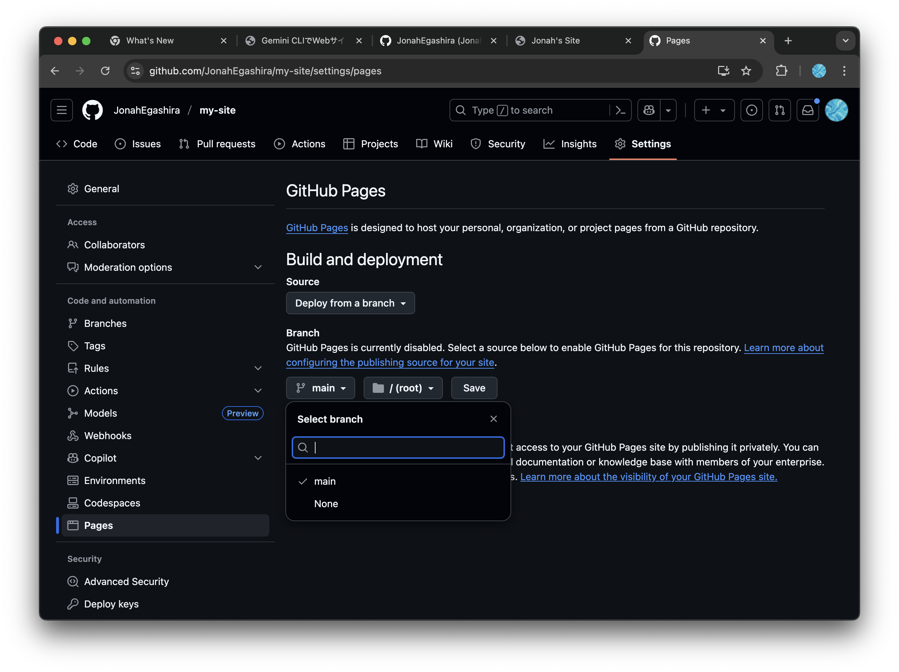

# Gemini CLIでWebサイトをつくろう

# 1. はじめに

### 目的

- AIエージェントであるGemini CLIを用いて、GitHub Pages上にサイトを構築する方法を学び、実際に公開する

### 得られるもの

- Gemini CLIの導入方法と使い方
- ターミナル上でのGitの基礎の操作、GitHubの使い方
- VSCodeなどのコードエディタの簡単な使い方
- HTML, CSS, Java Scriptを使ったWebサイト作成の方法

### 得られないもの

- HTML, CSS, Java Scriptの詳細な文法
- Geminiなどの言語モデル自体の理論

### 進め方

- わからないことは積極的に近くの人やChatGPT, Geminiに聞きましょう
- すでにGit, GitHubに慣れていたりする人はどんどん進めて構いません。周りの人が困っていたら助けてあげましょう
- 講義スライドはありません。このWebページの内容を元に進めます

## Gemini CLIとは

- Googleが提供するオープンソースのAIエージェントです。
- ターミナル上でGeminiモデルを利用してコード生成・修正、文章作成など、複数の業務を自然言語で操作可能です
- Webサイト上で使用するGeminiと違って、Gemini CLIはエージェントとして自身のPC上で色々な操作をしてくれますが、最低限ターミナル上での操作を覚える必要があります

# 2. GitHubアカウントを作成しよう

Web サイトを公開したり、開発を行う上では **GitHub アカウント** があると便利です

1. ブラウザで [https://github.com](https://github.com) を開く  
2. 右上の **Sign up** をクリック  
3. メールアドレス・ユーザー名・パスワードを入力し、画面の指示に従って登録  
4. 登録が完了すると、あなたの **GitHub プロフィールページ** が表示されます


## GitとGitHubについて

### Git
- **バージョン管理システム**の一つです
- ファイルの変更履歴を記録し、過去の状態に戻したり、変更内容を確認できます
- 例：文書、プログラムを書いていて「3日前の版に戻したい」というときに便利です

### GitHub
- Gitを使ったプロジェクトを**インターネット上で管理・共有**できるサービスです
- 世界中の開発者が利用している最大級のプラットフォームです
- 無料でWebサイトを公開できる「GitHub Pages」機能があります

### Git, GitHubが使われる理由
1. **失敗しても安心** - いつでも前の状態に戻せます
2. **共同作業が簡単** - 複数人で同じプロジェクトを編集できます
3. **無料でWebサイト公開** - GitHub Pagesで自分のサイトを世界に公開できます

---

# 3. 開発環境の準備

本講義中は、GitHub Codespacesを用いてGemini CLIを利用します。GitHub Codespacesは、クラウド上で開発環境を提供するサービスで、ブラウザだけで開発環境を利用できます。これにより、インストールやセットアップの手間を省き、すぐに開発を始めることができます。


| 選択肢 | 特長 | モチベーション |
|--------|------|--------------------|
| **GitHub Codespaces** | ◎ インストール不要<br/>◎ ブラウザだけで完結<br/>◎ 社用 PC でも OK | Gemini CLIだけとりあえず使ってみたい / セットアップを短時間で終わらせたい |
| **ローカルセットアップ** | ◎ 自分のPC上でAIエージェントが動く<br/>◎ ターミナル学習に最適 | コマンド操作を学びたい / 今後も開発をしてみたい |


---

# GitHub Codespaces

## **GitHub Codespaces とは？**

* **クラウド上にあるパソコン**を、あなた専用の開発用に用意してくれるサービスです。
* 実際のパソコンは触らず、**インターネット経由でアクセス**して使います。

* **環境構築不要**
  自分のPCに何もインストールしなくても、すぐ開発を始められます。
* **どのPCでも同じ環境**
  チーム全員が同じ設定で作業できる
* **クラウドの高性能マシンが使える**
  必要に応じて CPU やメモリを増やせる（2〜32コア）

---

💡 例えるなら：

> 「自分専用のプログラミング用ノートパソコンを、GitHub がクラウド上に貸してくれるサービス」
> 必要なときだけ呼び出して、終わったら閉じる感じです。

---

## GitHub Codespacesの作成手順

### GitHub リポジトリを新規作成

- リポジトリとは、Gitで管理しているフォルダ、ディレクトリのことです。

<details markdown="1">
<summary>補足：💡フォルダ、ディレクトリ、リポジトリの違い</summary>

### **📦 フォルダ**

* パソコンの中でファイルを入れる「入れ物」
* 物理的なディレクトリ構造の見た目のこと

---

### **📂 ディレクトリ**

* フォルダとほぼ同じ意味ですが、**コンピュータ用語寄り**
* ターミナルやコマンドラインで「今いる場所」を指すときに「ディレクトリ」と言う
* 例：`cd my-site` は「my-site」というディレクトリに移動」

---

### **📁 リポジトリ（Repository）**

* Gitで管理されているフォルダ（＋その中の履歴データ）
* 普通のフォルダとの違いは「中に `.git` という隠しフォルダがあり、過去の履歴や設定が入っている」こと
* GitHubにアップすると、そのままインターネット上のリポジトリにもなる

</details>


1. [GitHub にログイン](https://github.com/login)し、右上の「＋」→ [**New repository**](https://github.com/new) をクリック  
 
2. Repository name に任意の名前 (例: `my-site`) を入力し、Add READMEをOnにして **Create repository**をクリック


### Codespace を起動
1. 作成したリポジトリのトップページがこのようになっていることを確認

2. 右上の「＋」→ **New Codespace** をクリック

3. Codespace作成の設定画面に移行するので、Repositoryから先ほど作成したリポジトリを選択。そのほかの設定はデフォルトのままでOK. **Create codespace**をクリック


## Codespacesの画面構成

GitHub Codespacesは、クラウド上で動作するVS Code（Visual Studio Code）のようなものです。VS Codeは、Microsoftが提供する無料のソースコードエディターで、多くのプログラミング言語をサポートし、拡張機能を通じて機能を追加することができます。

以下に、CodespacesおよびVS Codeの画面構成について簡単に説明します。


1. **ファイルエクスプローラー**  
   左側に表示されるファイルエクスプローラーは、プロジェクト内のファイルやフォルダを表示します。ここからファイルをクリックすることで、エディターで開くことができます。VS Codeでも同様に、プロジェクトの構造を視覚的に把握することができます。

2. **エディター**  
   画面中央に位置するエディターは、コードを編集するための領域です。VS Codeと同様に、シンタックスハイライトやコード補完機能が利用でき、効率的にコードを書くことができます。

3. **ターミナル**  
   画面下部に表示されるターミナルは、コマンドを実行するためのインターフェースです。ここでGitコマンドやnpmコマンドを実行して、プロジェクトの管理やビルドを行うことができます。VS Codeでもターミナルを内蔵しており、同様の操作が可能です。


### Gemini CLI を起動してログイン
Codespaces のターミナルで以下を実行します。
```bash
npx @google/gemini-cli
```


- Google アカウントでのログインを求められるので。`1. Login with Google`を選択しましょう。


- `1. Login with Google`を選択したら、ターミナル上に出てくるURLをクリックします。
- 一度目ではこのURLが出てこない場合がありますが、その時は再度`npx @google/gemini-cli`を実行して下さい。


- URLをクリックしたらGoogleでのログインが求められます。ログイン後、このようなページとコードが表示されるので、`Copy`を押してコードをコピーします。


- 再度Codespacesに戻り、このコードをペーストして、Enterを入力します。


成功すると、このような大きな`GEMINI`の文字が表示され、Gemini CLIに対してメッセージを送って使える状態になります。

ここまで確認できれば Codespaces 環境の準備は完了です。以降のサイトの作成・公開手順は「[Gemini CLIでWebサイトを作成する](#gemini-cliを使ってwebサイトを作成する)」セクションを参照してください。


<details markdown="1"><summary>Codespaces 無料枠について</summary>

- 個人アカウントは **60 h / 月・120 core h / 月** までは無料  
- 超過すると従量課金。使い終わったら Codespace を **Stop** / **Delete** すると安心  
- **Settings → Codespaces → Usage** で残り時間が確認できます
</details>

---

# ローカル環境構築編（オプション）

- 自分のPC上でGemini CLIを利用したい人向けの資料です。ローカルでGemini CLIを利用できるようになると、ファイル・フォルダ操作の自動化や、手元にある文書ファイルをGeminiが編集してくれるようになったりします。今後開発をしてみたいという方も、ローカルで開発環境を準備するのがおすすめです。準備は少々大変ですが、フォローアップも行いますので、ぜひ興味のある人は取り組んでみてください。

## Gitの準備とローカル操作（Mac / Windows）

### 1. ターミナルを開く

<details markdown="1"><summary>Macの場合</summary>

* 標準の **「ターミナル」** アプリを使います 

1. Finderで「アプリケーション → ユーティリティ → ターミナル」を開く
   または **Spotlight検索（⌘+Space）** で「ターミナル」と入力して起動します
2. 黒い（または白い）ウィンドウが開きます
3. ここで以降のコマンドを入力します

</details>

---

<details markdown="1"><summary>Windowsの場合</summary>

* **おすすめ**：Gitをインストールすると一緒に入る **Git Bash** を使うと便利です
  （黒い画面にLinux風のコマンドが使える）

1. [Git for Windows](https://gitforwindows.org/) をダウンロードしてインストール
2. スタートメニューで **「Git Bash」** を検索して起動
   （黒いウィンドウが開きます）
3. ここで以降のコマンドを入力します

※ もしPowerShellやコマンドプロンプトしか使えない場合も同じコマンドが使えますが、Git Bashのほうが初心者にはやさしいです

</details>

### 2. Gitが入っているか確認

```bash
git --version
```

* **バージョン番号が表示されればOK**
* Macでは入っていない場合、自動で「開発者ツールをインストールしますか？」と聞かれるので「はい」を選びます
* Windowsで「command not found」や「認識されません」と出たら、Gitがインストールされていないので、[Git for Windows](https://gitforwindows.org/)をインストールしましょう。

---

### 3. SSHキーを作成してGitHubと接続

#### **SSHキー作成**

```bash
ssh-keygen -t ed25519 -C "あなたのメールアドレス"
```

* **Enter**を3回押す（パスフレーズは空でOK）
* キーは `~/.ssh/id_ed25519.pub` に作られます

### ⚠️注意事項⚠️

- `.pub`がついているファイルは**公開鍵**で、他人に公開しても問題ありません
- `.pub`がついていないファイルは**秘密鍵**で、絶対に他人に教えたり、Webサイト上に貼り付けたりしてはいけません

この点に注意して、SSHキーを安全に管理してください。


#### **公開鍵をコピー**

```bash
cat ~/.ssh/id_ed25519.pub
```

（WindowsのGit Bashでも同じコマンドでOK）

#### **GitHubに登録**

1. GitHub → 右上プロフィール → **Settings**
2. 左メニューの「**SSH and GPG keys**」をクリック
3. **New SSH key** を押す

4. **Title**：わかりやすい名前（例：My Laptop）
5. **Key**：コピーした公開鍵を貼り付け
6. **Add SSH key** を押す

---

### 4. 接続テスト

```bash
ssh -T git@github.com
```

* 「Hi \[ユーザー名]!」と出ればOK

---

### 5. Gitのユーザー情報を設定

```bash
git config --global user.name "あなたの名前"
git config --global user.email "あなたのメールアドレス"
```
<details markdown="1">
<summary>補足：💡SSHキーとは何か</summary>

* **SSH**（Secure Shell）は、インターネット越しに安全にサーバーとやりとりするための仕組みです
* **SSHキー**は「合鍵ペア」のようなもので、

  * **秘密鍵** → あなたのPCに保管（絶対外に出さない）
  * **公開鍵** → GitHubに登録してOK
* GitHubは「この公開鍵と合う秘密鍵を持っている人だけを信頼する」しくみ
* これにより、**毎回パスワードを入力せずに、安全に接続できる**ようになります

> **例えるなら…**
> 郵便受けに自分専用の鍵穴を付けて、鍵を持っているのはあなただけ。
> 郵便屋さん（GitHub）はその鍵でしか開かないようにしてくれる…そんなイメージです。
</details>

## GitHubでリポジトリを作成

### 1. GitHubで新しいリポジトリを作成

1. GitHubにログインし、[https://github.com/login](https://github.com/login) にアクセスしてログイン
2. ログイン後、[https://github.com/new](https://github.com/new) にアクセス
2. **New repository** のページが表示されます
3. **Repository name**：任意の名前を入力（例：`my-site`）
4. 他の設定はデフォルトのままでOK（**README**は作成しなくてOK. Choose VisibilityもPublicのまま）
5. **Create repository** をクリック

作成が完了したら以下のような画面になる。一旦ページはこのままにしておいて、次のステップに進む。


### 2.ローカルにリポジトリを作成し、GitHubのリポジトリと紐づける

1. ターミナル上でコマンドを打ってリポジトリを作成する
```bash
mkdir my-site # my-siteという名前のディレクトリを作成
cd my-site # my-siteのディレクトリに移動
echo "# my-site" >> README.md # READMD.mdというファイルを作成し、"my-site"という行を入れる
git init # そのディレクトリをGit管理する初期化コマンド
git add README.md # READMD.mdをGit管理する
git commit -m "first commit" # Git管理に追加した変更をコミットする（記録をつける）
git remote add origin git@github.com:<"あなたのアカウント名">/my-site.git # GitHub上のリポジトリに紐づける
git push -u origin main # GitHub上のリポジトリに、ローカルでの変更を適用する
```

- ここまでできたら、先ほど作成したGitHubのリポジトリのページを更新して確認してみてください。`README.md`というファイルが追加されているはずです


<details markdown="1">
<summary>補足：💡mkdir, cd, echoコマンドの詳細</summary>

### **📂 mkdir**

* `mkdir`は「make directory」の略で、新しいディレクトリ（フォルダ）を作成するコマンドです
* 例：`mkdir my-site` は「my-site」という名前のディレクトリを作成します

---

### **📂 cd**

* `cd`は「change directory」の略で、現在のディレクトリを変更するコマンドです
* 例：`cd my-site` は「my-site」というディレクトリに移動します

---

### **📂 echo**

* `echo`は指定した文字列を出力するコマンドです
* 例：`echo "# my-site" >> README.md` は`README.md`というファイルに`# my-site`という行を追加します

</details>

---

## Gemini CLI のインストール

## Node.jsのインストール

Gemini CLIをインストールするために、`Node.js`という実行環境が必要になります
`Node.js`はJavaScriptをパソコン、サーバー上で実行するための環境で、Gemini CLIなどのツールをインストールする際も使用されます

### **Mac**

#### 方法1: 公式インストーラー（初心者向け）

1. **公式サイトへアクセス**
   [https://nodejs.org/](https://nodejs.org/)

2. **推奨版（LTS）をダウンロード**（macOS Installer）

3. **インストーラーを実行** → すべてデフォルトでOK

4. **確認**（ターミナル）

   ```bash
   node -v
   ```

---

### **Windows**

1. **公式サイトへアクセス**
   [https://nodejs.org/](https://nodejs.org/)

2. **推奨版（LTS）をダウンロード**
   緑色の **"LTS"** ボタンをクリック

3. **インストーラーを実行**

   * すべて「Next」でOK（特別な設定不要）
   * **"Add to PATH"** にチェックが入っていることを確認

4. **インストール確認**
   コマンドプロンプト（または PowerShell）で

   ```bash
   node -v
   ```

   バージョンが表示されればOK

---

#### 方法2: Homebrew（Macに慣れてる方向け）

1. **Homebrewインストール済み**か確認（なければ[公式](https://brew.sh/)）
2. ターミナルで

   ```bash
   brew install node
   ```
3. 確認

   ```bash
   node -v
   ```

<details markdown="1">
<summary>補足：💡JavaScriptとNode.jsの関係</summary>

### 1. JavaScriptとは？
- **プログラミング言語**のひとつ
- 本来は**ブラウザの中で動く**ために作られた
- Webページに動きをつける、フォームの入力チェック、アニメーションなどで活躍

---

### 2. Node.jsとは？
- **JavaScriptをブラウザの外で動かせるソフトウェア（ランタイム環境）**
- Google Chromeの「V8 JavaScriptエンジン」を利用
- サーバーやパソコン上でJavaScriptを直接実行できる

---

### 3. 関係を一言でいうと
> **JavaScript**：言語そのもの  
> **Node.js**：その言語をパソコンやサーバーで動かすための実行環境

---

</details>

## Gemini CLIのインストール

以下のコマンドを実行してインストール
```bash
npm install -g @google/gemini-cli
```

<details markdown="1">
<summary>補足：💡npmとは？</summary>

### npmとは？
- **Node Package Manager**の略
- Node.jsのための**パッケージ管理ツール**
- JavaScriptのライブラリやツールを簡単にインストール、管理、共有できる
- コマンドラインから利用可能で、`npm install`コマンドでパッケージをインストール

</details>


## Gemini CLIの実行

ローカルでの環境構築お疲れ様でした。ターミナル上で`gemini`と入力して、Gemini CLIを起動しましょう
```bash
gemini
```

このような画面が出たら成功です。

### VSCodeのインストールとコードの確認

今後コードの生成はGemini CLIがやってくれますが、手動で変更したい部分も出てきます。そこで、コードエディターであるVSCodeをインストールしましょう

1. **公式サイトへアクセス**
   [https://code.visualstudio.com/](https://code.visualstudio.com/)

2. **ダウンロード**
   お使いのOSに合わせたインストーラーをダウンロードしてください

3. **インストーラーを実行**
   ダウンロードしたインストーラーを実行し、画面の指示に従ってインストールを完了させます

4. **VSCodeを起動**
   インストールが完了したら、VSCodeを起動します

5. **リポジトリを開く**
   - メニューから「ファイル」→「フォルダーを開く」を選択します
   - 先ほど作成したリポジトリのフォルダ（例：`my-site`）を選択し、「フォルダーを選択」をクリックします
   
6. **VS Codeの画面構成**
   - GitHub Codespaceと同じく、左側にファイル管理、中央にコードエディタ、下部にターミナル等がデフォルトでは配置されています。
   

- 基本的にはGemini CLIがコードの作成、編集など全ておこなってくれますが、一部分すぐに直したかったり、どんなコードが書かれているかを確認したい時はVSCodeなどのコードエディタをしようするのも便利です


# Gemini CLIでWebサイトを作成する

## HTMLファイルの作成　

- Gemini CLIのインストールが完了したら、実際にWebサイトを作っていきましょう
- ターミナル上で先ほど作成したリポジトリにいることを確認、もしくは移動してください
```bash
pwd # 先ほど作成したmy-siteが表示されたらOK
```

**📂 pwd**

* `pwd`は「print working directory」の略で、現在の作業ディレクトリのパスを表示するコマンドです
* 例：`pwd` を実行すると、現在のディレクトリのフルパスが表示されます

### Geminiに依頼する

以降、Gemini CLIを起動して、Gemini CLI上で入力する内容は、`user>`を先頭に書く以下ような書き方をすることとし、Geminiからの返答は`gemini>`を先頭に書くこととします
```bash
user> ここにGeminiへのメッセージ、プロンプトが入ります。
gemini> Geminiからの返答はこのように書きます。
```


では、早速GeminiにHTMLファイルを作ってもらいましょう
```bash
user> このリポジトリは、GitHub Pagesで公開する自分のWebサイトです。シンプルなHTMLを作成してください。
```

すると、私の場合は以下のように返ってきたので、内容についてのメッセージを追加します
```bash
gemini> はい、承知いたしました。シンプルな index.html を作成します。どのような内容がよろしいですか？特にご希望がなければ、基本的な「こんにちは」というメッセージを入れたものを作成します。
user> タイトルは「Jonahのサイト」で、ようこそ！と言うメッセージでお願いします。
```

GeminiがHTMLファイルの内容を作成し、ユーザにファイル作成と変更の許可を求めます


```bash
1. Yes, allow once (今回のみ変更を許可する)
2. Yes, allow always (このセッション内でのHTMLファイルの作成と変更を常に許可する)
3. Modify with external editor (他のエディターでHTMLファイルを手動で変更する)
4. No, suggest changes (esc) (Geminiが提案した変更を却下し、別の変更内容をユーザーが提案する)
```

今回は 1. の`Yes, allow once`を選択しましょう。HTMLファイルが作成されます。

### ⚠️Gemini CLIの許可に関する注意点⚠️

実行するコマンドには十分注意してください。特に、`rm` や `rm -rf` などの削除系コマンドは、誤って重要なファイルを削除してしまう可能性があります。そのため、これらのコマンドに対しては `allow always` を選択しないことを**強くおすすめ**します。慎重に操作を行い、必要に応じて `allow once` を選択するようにしましょう

### HTMLファイルをブラウザで表示する

HTMLファイルが作られていることが確認できたら、実際にブラウザ上でどんな見た目か確認してみましょう


### WindowsでHTMLファイルをブラウザで開く方法

1. **エクスプローラーでファイルを探す**
   - エクスプローラーを開き、作成したHTMLファイル（例：`index.html`）が保存されているフォルダに移動します

2. **ファイルをダブルクリック**
   - HTMLファイルをダブルクリックすると、デフォルトのブラウザでファイルが開きます

3. **右クリックメニューから開く**
   - HTMLファイルを右クリックし、「プログラムから開く」→「ブラウザ名」を選択して開くこともできます

### MacでHTMLファイルをブラウザで開く方法

1. **Finderでファイルを探す**
   - Finderを開き、作成したHTMLファイル（例：`index.html`）が保存されているフォルダに移動します

2. **ファイルをダブルクリック**
   - HTMLファイルをダブルクリックすると、デフォルトのブラウザでファイルが開きます

3. **右クリックメニューから開く**
   - HTMLファイルを右クリックし、「このアプリケーションで開く」→「ブラウザ名」を選択して開くこともできます

### 共通の方法

- **ドラッグ＆ドロップ**
  - HTMLファイルをブラウザのウィンドウにドラッグ＆ドロップすることで、ファイルを開くことができます

- **ブラウザの「ファイル」メニューから開く**
  - ブラウザを開き、メニューから「ファイル」→「ファイルを開く」を選択し、HTMLファイルを選択して開くことも可能です

これらの方法で、作成したHTMLファイルを簡単にブラウザで確認することができます


## HTMLをGitHub上のリポジトリにPush


### Pushとは

Pushとは、ローカルで行った変更をリモートリポジトリ（GitHubなど）に送信する操作のことです。これにより、他の開発者と変更を共有したり、リモートリポジトリを最新の状態に保つことができます

### Pushの方法

1. **変更をステージングする**
   - まず、ローカルで行った変更をステージングエリアに追加します
   ```bash
   git add .
   ```

2. **変更をコミットする**
   - ステージングエリアに追加した変更をコミットします
   ```bash
   git commit -m "変更内容の説明"
   ```

3. **リモートリポジトリにプッシュする**
   - コミットした変更をリモートリポジトリにプッシュします
   ```bash
   git push origin main
   ```
   - `main`はプッシュしたいブランチ名です。必要に応じて他のブランチ名に置き換えてください

これで、ローカルの変更がリモートリポジトリに反映されます。プッシュすることで、他の開発者と変更を共有し、プロジェクトを共同で進めることができます

## 🤖 Gemini CLIを使ったGitの操作

変更があるたびに、ターミナルに`git add .`とか、`git commit`とかを毎回打つのは面倒です。そこで、そのようなGitの操作も全てGemini CLIにお任せしてみましょう

```bash
user> いまある変更を全てpushして欲しい。
```


すると、Gemini CLIが現在の変更を確認するGitコマンド`git status`を実行し、現状を確認した上で`add`, `commit`, `push`までおこなってくれます

**⚠️注意⚠️** `git push`等は慎重に行いたいコマンドなので、allow alwaysにせず、allow onceで毎回確認するのがよいでしょう

### GitHub上でPushできているか確認

Pushが完了したら、GitHub上のリポジトリに正しく追加できているか確認してみましょう。先ほどGitHub上で作成したリポジトリに、index.htmlがあれば成功です


## GitHub Pagesを使ってデプロイ

### GitHub Pagesとは

GitHub Pagesは、GitHubが提供するサービスで、簡単にWebサイトを作れる場所です。GitHubに保存したHTML、CSS、JavaScriptのファイルを使って、無料でWebサイトを公開できます。例えば、自分の作品を紹介するページや、プロジェクトの説明ページを作るのにとても便利です

### デプロイとは

デプロイ（Deploy）とは、開発したアプリケーションやWebサイトを実際にユーザーがアクセスできる環境に配置することを指します。GitHub Pagesを使うと、リポジトリにあるコードを簡単にWeb上に公開（デプロイ）することができます

### GitHub Pagesを使ったデプロイ手順

1. **GitHubリポジトリを準備**
   - デプロイしたいプロジェクトのリポジトリをGitHub上に作成します。（今回は作成済みの`my-site`リポジトリです）

2. **リポジトリにコードをpush**
   - ローカルで作成したHTML、CSS、JavaScriptファイルをリポジトリにpushします（すでにpush済みです）

3. **GitHub Pagesの設定**
   - リポジトリのページに移動し、右上の「Settings」をクリックします
   - 左側のメニューから「Pages」を選択します

4. **公開するブランチを選択**
   - 「Source」セクションで、公開したいブランチ（通常は`main`）を選択します
   - 「Save」をクリックして設定を保存します
   

5. **サイトの公開を確認**
   - 設定が完了すると、GitHub PagesのURLが表示されます。このURLをクリックすると、公開されたWebサイトを確認できます

これで、GitHub Pagesを使ってプロジェクトをデプロイすることができます。公開されたサイトは、GitHubリポジトリの更新に応じて自動的に更新されます

## ウェブサイトの内容を豪華にする

HTMLファイルだけのウェブサイトでは見た目が寂しいので、内容と見た目を改善しましょう
まずはGemini CLIを使って（もしくは手動で）、HTMLファイルの中身を適当に増やします

```bash
user> index.htmlの内容が少ないので、適当に増やしてください
```

Gemini CLIがどんな内容を追加したいか聞いてくるので、対話しながらページの内容を決めてください

### CSSを追加する

#### CSSとは
CSS（Cascading Style Sheets）は、ウェブページの見た目を良くするための言語です。CSSを使うと、文字の色やフォント、背景色、レイアウトなどを簡単に変えられます。HTMLがページの骨組みを作るのに対し、CSSはその見た目を整えます。これにより、内容とデザインを分けて管理できるので、ウェブサイトを効率よく作れます

#### Gemini CLIでCSSを追加してページの見た目を整える

```bash
user> index.htmlの見た目をよくするために、cssファイルを追加して、スタイリングを行なってください。
```


Gemini CLIが、`style.css`ファイルを作成し、スタイルを記述するコードを生成していることが確認できます
また、`index.html`でそのcssファイルを読み込んでスタイルを適用させるために、htmlファイルも編集を加えています

HTMLファイルを再度ブラウザで開いて、見た目を確認してみましょう


シンプルな白黒の見た目から、少し豪華になりました

Gemini CLIと対話して、好きなスタイルを作ってみましょう

```bash
user> ハッカー風の画面にして。
```


## JavaScriptを追加する

### JavaScriptとは
JavaScriptは、ウェブページに動的な機能を追加するためのプログラミング言語です。ユーザーの操作に応じてページの内容を変更したり、アニメーションを追加したり、データを処理したりすることができます。HTMLとCSSがウェブページの構造と見た目を担当するのに対し、JavaScriptはインタラクティブな要素を提供します

JavaScriptを使うことで、ユーザーの入力に応じたリアルタイムのフィードバックや、ページの一部を動的に更新することが可能になります。これにより、よりリッチでユーザーフレンドリーなウェブ体験を提供できます

Gemini CLIを使って、JavaScriptを追加し、ページにインタラクティブな要素を加えてみましょう

```bash
user> JavaScriptを使って、ページにタイピング風のアニメーションを追加したい。
```


自分好みのアニメーションや機能を実装してみましょう

```bash
user> なんか上から数字が降ってきて、ハリウッドのハッカー映画みたいなページにして欲しい。
```


- 変更をしたらこまめに`add`, `commit`をして、区切りが付いたら`push`してデプロイ先に反映させましょう

## まとめ

この講習会では、Gemini CLIを使用してGitHub Pages上にWebサイトを構築する方法を学びました。以下に主要なポイントをまとめます：

- **Gemini CLIの活用**: Gemini CLIを使って、コード生成や修正、文章作成を効率的に行う方法を学びました
- **GitとGitHubの基礎**: バージョン管理システムであるGitの基本操作と、GitHubを使ったプロジェクトの管理・共有方法を理解しました
- **Webサイトのスタイリング**: CSSを用いてWebサイトの見た目を改善し、より魅力的なデザインを実現しました
- **JavaScriptの導入**: JavaScriptを使って、Webページに動的な機能を追加し、インタラクティブな要素を提供する方法を学びました

これらのスキルを活用して、さらに高度なWebサイトを構築し、公開することができます。Gemini CLIと共に、あなたの創造力を活かして楽しいWebページを制作しましょう
