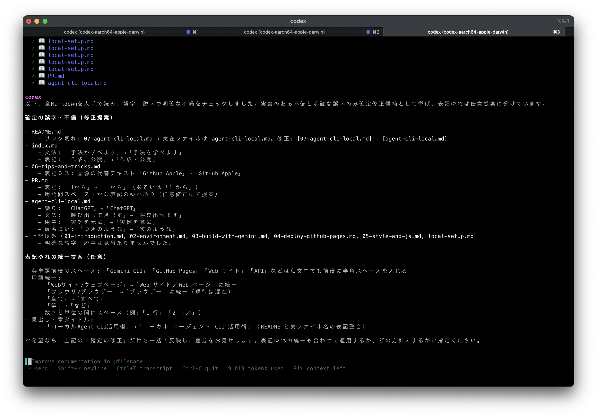
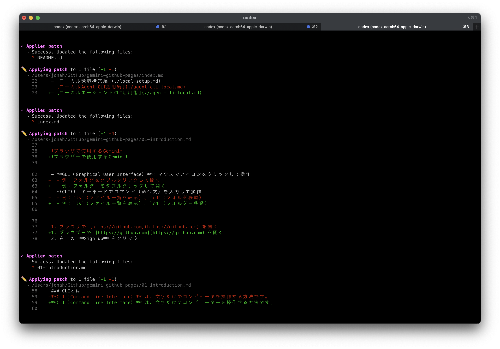

# ローカルにエージェントCLIを入れてできること

Gemini CLI（または同種のエージェントCLI。例: Claude CodeやCodex CLI）を自分のPCに導入して使うと、WebやGUIのチャットでは手間のかかる作業も、手元のファイルやコマンドを直接扱いながら一気に片付けられます。ここでは実例に基づき、どんな場面で真価を発揮するかを紹介します。

本ページの対象読者は、Gemini CLIなどのエージェントCLIをローカルにインストール済みの方です。講義中よりも説明が省略されている箇所もあるため、適宜調べながら読み進めてください。

本資料中の `user>` は「エージェントへの入力例」を示す記法です。

## 何が嬉しいのか

さまざまなメリットがありますが、筆者が特に感じる大きな利点は次の2点です。

- 手元のファイルを横断的に扱える: ディレクトリをまたいで検索・集約・編集ができます。
- コマンドと連携: `git`、`gh`、`ffmpeg`など、ありとあらゆるコマンドを自然言語で呼び出せます。難解な引数も覚えずに実行できるのが利点です。

---

## PC上のテキストの作成・校正

文章の作成や校正では、みなさんもChatGPTやGeminiを活用していると思いますが、以下のような経験はないでしょうか。

- 手元のファイル内容をコピー＆ペーストしたり、生成結果を貼り戻したりするのが手間。
- 複数ファイルにまたがる文書をまとめてChatGPTに送るのが手間。

ローカルで動作するエージェントCLIであれば、これらの悩みを解消できます。

実際に本資料はGemini CLIで校正しています。
本資料はMarkdownファイルで書かれており、以下のような構成です。

```bash
.
├── _config.yml
├── 01-introduction.md
├── 02-environment.md
├── 03-build-with-gemini.md
├── 04-deploy-github-pages.md
├── 05-style-and-js.md
├── 06-tips-and-tricks.md
├── agent-cli-local.md
├── images
│   ├── 3d.gif
│   ├── ... other images
├── index.md
├── local-setup.md
├── PR.md
└── README.md
```

これらのMarkdownファイル全体で誤字・脱字をチェックする場合は、次のように指示できます。


```bash
user> すべてのMarkdownの誤字脱字をチェックして。
```

ここではGemini CLIではなく、Codex CLIに依頼してみました。



誤字と表記揺れの指摘を受けたため、その場で表記を統一するよう依頼しました。



このように、複数ファイルの文書の校正や執筆において、エージェントCLIは非常に便利です。

### 重要なポイント

エージェントCLIで文書やプログラムを編集するときは、必ずGitで管理しましょう。意図しない変更が加えられたり、最悪の場合ファイルを削除されることもあります。
もしそうした望まない変更があっても、Gitで管理していればすぐに元のバージョンに復元できます。重要なファイルをエージェントが編集する前に、必ずバージョン管理しておきましょう。

## 複雑なコマンドの実行

世の中に便利なコマンドラインツール（ターミナルで実行するコマンド）は無数にありますが、それらのコマンドはしばしば複雑です。

### `gh`コマンド おすすめ⭐︎

`gh`はGitHubが公式に提供しているコマンドラインツール（GitHub CLI）で、ターミナルから「PR、Issue、Release、Repo操作」など"GitHubでやること"を一通り扱えるようにするものです。
`git`がソース管理そのものを操作するのに対して、`gh`はGitHubの機能（PR/Issue/Actions など）を操作します。

たとえば、`gh`コマンドでPRを作成する時は次のようにします。

```bash
gh pr create -B main \
  -t "feat: 新しい検索UIの導入" \
  -b "一覧にフィルターを追加。キーボード操作にも対応。\nCloses #123"
```

`-t`でタイトルを指定し、`-b`で本文を記述します。

`gh`を手動で実行したり引数を覚えるのは大変ですが、エージェントCLIを使えば簡単にPRを作成したり、Issueを確認できます。

```bash
user> このブランチからmainに向けてPRを作成して。
```

エージェントCLIは`git`の差分を見て自動でPRのタイトルや本文も作成してくれるので、非常に便利です。

### `ffmpeg`

```bash
ffmpeg -i 3d.mov -filter_complex "[0:v]fps=15,scale=640:-1:flags=lanczos,split[a][b];[a]palettegen=stats_mode=full[p];[b][p]paletteuse=new=1:dither=bayer:bayer_scale=3" -loop 0 3d.gif
```

`ffmpeg`は動画や音声ファイルの編集をコマンドラインで行えるツールです。上記の例は動画ファイル（3d.mov）を高品質なGIFファイルに変換するためのコマンドです。
とはいえ、こんなコマンドは覚えられません。

エージェントCLIを使えば、動画があるディレクトリでエージェントを起動し、`user> 3d.movをffmpegを使ってGIFにして`と言えば、自動でコマンドを生成して処理してくれます。

ChatGPTに聞いてコマンドを教わることもできますが、実行時にエラーが発生した際には、エージェントがエラーメッセージを読み取り、自動でコマンドを調整してくれます。何より、ターミナルから離れずに作業を続けられるのは大きな強みです。

## コードベースの探索と説明を依頼する

PC上のテキストの校正に近い話ですが、プログラムのソースコードを探索・理解する場面でもエージェントCLIは強力です。
最近のWebアプリケーションやライブラリは、フォルダが深くネストされ、数百・数千のファイルで構成されることも珍しくありません。

こうしたプロジェクトを新しく`git clone`してきた時、全体像を把握するのは大変です。しかし、エージェントCLIなら：

```bash
user> このプロジェクトの構造を解析して、主要な機能と技術スタックを説明して。
```

エージェントは主要なディレクトリを探索し、package.jsonやコード内のimport文を解析して、使用されているライブラリや設計パターンを特定してくれます。

