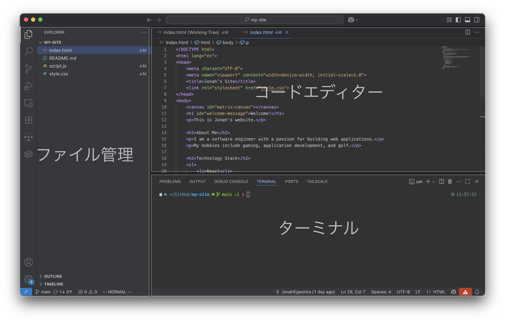
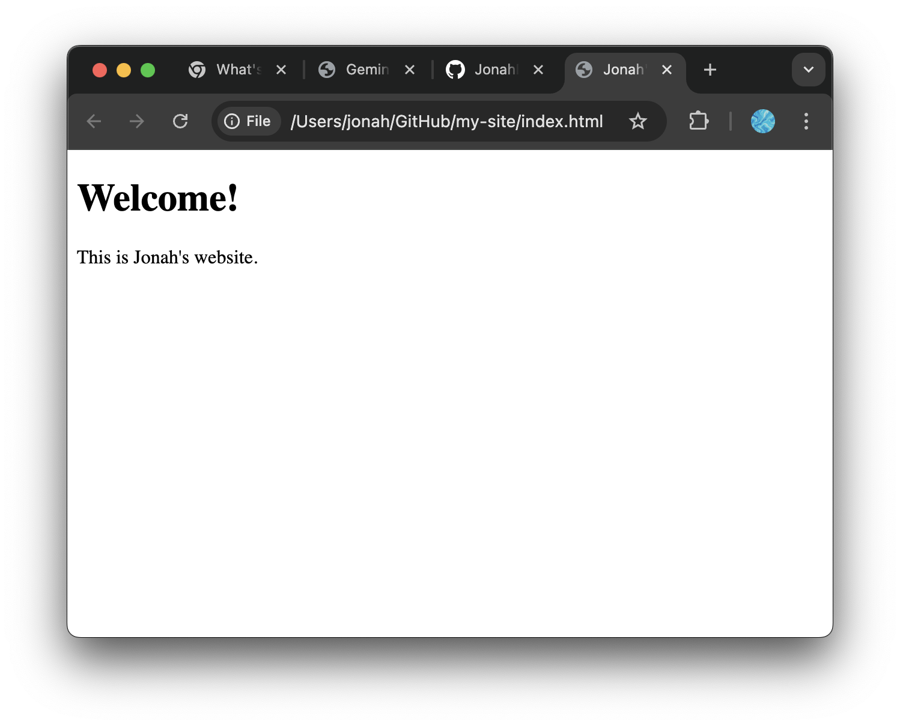

# 自分のPCでGemini CLIを使う

- 自分のPC上でGemini CLIを利用したい方向けの資料です。ローカルでGemini CLIを使えるようになると、ファイル・フォルダー操作の自動化や、手元の文書ファイルをGeminiに編集させることができます。初めて開発に取り組む方にとって準備は少し大変ですが、フォローアップも行うので、ぜひ挑戦してみてください。

## Gitの準備とローカル操作（Mac/Windows）

まずはPC上でGitを使えるようにして、GitHubに自分のファイルをアップロードできるようにします。

### 1. ターミナルを開く

<details markdown="1"><summary>Macの場合</summary>

* 標準の **「ターミナル」** アプリを使います 

1. Finderで「アプリケーション → ユーティリティ → ターミナル」を開く
   または **Spotlight検索（⌘+Space）** で「ターミナル」と入力して起動します
2. 黒い（または白い）ウィンドウが開きます
3. ここで以降のコマンドを入力します

</details>

---

<details markdown="1"><summary>Windowsの場合</summary>

* **おすすめ**：Gitをインストールすると一緒に入る **Git Bash** を使うと便利です
  （黒い画面にLinux風のコマンドが使える）

1. [Git for Windows](https://gitforwindows.org/) をダウンロードしてインストール
2. スタートメニューで **「Git Bash」** を検索して起動
   （黒いウィンドウが開きます）
3. ここで以降のコマンドを入力します

---

#### PowerShellで使う場合（標準のターミナル）

1. スタートメニューで **「PowerShell」** を検索して起動
2. `git --version` が表示されれば、以降のコマンドはそのまま使えます
3. 公開鍵の表示は `cat` の代わりに `type` を使えます
   - 例：`type $env:USERPROFILE\.ssh\id_ed25519.pub`
4. `ssh` や `ssh-keygen` コマンドが見つからない場合は、Windowsの「OpenSSH クライアント」を有効化してください（管理者権限）
   - 設定 → アプリ → オプション機能 → OpenSSH クライアントを追加
   - または PowerShell（管理者）で：`Add-WindowsCapability -Online -Name OpenSSH.Client~~~~0.0.1.0`

---

#### Windows Terminalで使う場合（複数シェルをまとめて管理）

1. Microsoft Storeから **Windows Terminal** をインストール（入っていればOK）
2. タブのメニュー（∨）から **PowerShell** または **Git Bash** を選択
3. 選択したシェル上で本資料のコマンドを実行します

---

#### コマンドプロンプト（cmd.exe）で使う場合

1. スタートメニューで **「コマンド プロンプト」** を起動
2. 基本的に同じコマンドで操作できます
   - `cat` の代わりに `type` を使用（例：`type %USERPROFILE%\.ssh\id_ed25519.pub`）

</details>

このように囲われた文字はコマンドになります。Mac/Windowsでターミナルが開けたら、ターミナル上でこのコマンドを入力、もしくはコピー＆ペーストし、Enterキーで実行しましょう。

```bash
このように囲われた部分がコマンドです。
```

### 2. Gitがインストールされているか確認

```bash
git --version
```

* **バージョン番号が表示されればOK**
* Macでは入っていない場合、自動で「開発者ツールをインストールしますか？」と聞かれるので「はい」を選びます
* Windowsで「command not found」や「認識されません」と出たら、Gitがインストールされていないので、[Git for Windows](https://gitforwindows.org/)をインストールしましょう。

---

### 3. SSHキーを作成してGitHubと接続

<details markdown="1"><summary>SSHキーとは</summary>

* **SSH**（Secure Shell）は、インターネット越しに安全にサーバーとやりとりするための仕組みです
* **SSHキー**は「合鍵ペア」のようなもので、

  * **秘密鍵** → あなたのPCに保管（絶対外に出さない）
  * **公開鍵** → GitHubに登録してOK
* GitHubは「この公開鍵と合う秘密鍵を持っている人だけを信頼する」しくみ
* これにより、**毎回パスワードを入力せずに、安全に接続できる**ようになります

</details>

#### **SSHキー作成**

```bash
ssh-keygen -t ed25519 -C "あなたのメールアドレス"
```

* **Enter**を3回押す（パスフレーズは空でOK）
* 公開鍵は `~/.ssh/id_ed25519.pub` に作成されます

### ⚠️注意事項⚠️

- `.pub`がついているファイルは**公開鍵**で、他人に公開しても問題ありません
- `.pub`がついて**いない**ファイルは**秘密鍵**で、絶対に他人に教えたり、Webサイト上に貼り付けたりしてはいけません

この点に注意して、SSHキーを安全に管理してください。

#### **公開鍵をコピー**

```bash
cat ~/.ssh/id_ed25519.pub
```

（WindowsのGit Bashでも同じコマンドでOK）

#### **GitHubに登録**

1. GitHub → 右上プロフィール → **Settings**
2. 左メニューの「**SSH and GPG keys**」をクリック
3. **New SSH key** を押す

4. **Title**：わかりやすい名前（例：My Laptop）
5. **Key**：コピーした公開鍵を貼り付け
6. **Add SSH key** を押す

---

### 4. 接続テスト

```bash
ssh -T git@github.com
```

* 「Hi [ユーザー名]!」と出ればOK
* 初回は接続確認（Are you sure you want to continue connecting...）が表示されることがあります。表示されたら `yes` と入力して続行してください

---

### 5. Gitのユーザー情報を設定

```bash
git config --global user.name "あなたの名前"
git config --global user.email "あなたのメールアドレス"
```

## GitHubでリポジトリを作成

### 1. GitHubで新しいリポジトリを作成

1. GitHubにログインし、<https://github.com/login> にアクセスしてログイン
2. ログイン後、<https://github.com/new> にアクセス
3. **New repository** のページが表示されます
4. **Repository name**：任意の名前を入力（例：`my-site`）
5. 他の設定はデフォルトのままでOK（**README**は作成しなくてOK。Choose visibilityもPublicのまま）
6. **Create repository** をクリック

作成が完了したら、以下のような画面になります。いったんページはこのままにしておいて、次のステップに進みます。


### 2. ローカルにリポジトリを作成し、GitHubのリポジトリと紐づける

1. ターミナル上でコマンドを打ってリポジトリを作成する
```bash
mkdir my-site # my-siteという名前のディレクトリを作成
cd my-site # my-siteのディレクトリに移動
echo "# my-site" >> README.md # README.mdというファイルを作成し、"my-site"という行を入れる
git init # そのディレクトリをGit管理する初期化コマンド
git add README.md # README.mdをGit管理する
git commit -m "first commit" # Git管理に追加した変更をコミットする（記録をつける）
git branch -M main # デフォルトブランチ名をmainに変更
git remote add origin git@github.com:<あなたのアカウント名>/my-site.git # GitHub上のリポジトリに紐づける
git push -u origin main # GitHub上のリポジトリに、ローカルでの変更を適用する
```

- ここまでできたら、先ほど作成したGitHubのリポジトリのページを更新して確認してみてください。`README.md`というファイルが追加されているはずです

<details markdown="1"><summary>補足：💡mkdir, cd, echoコマンドの詳細</summary>

### **mkdir**

* `mkdir`は「make directory」の略で、新しいディレクトリ（フォルダ）を作成するコマンドです
* 例：`mkdir my-site` は「my-site」という名前のディレクトリを作成します

---

### **cd**

* `cd`は「change directory」の略で、現在のディレクトリを変更するコマンドです
* 例：`cd my-site` は「my-site」というディレクトリに移動します

---

### **echo**

* `echo`は指定した文字列を出力するコマンドです
* 例：`echo "# my-site" >> README.md` は`README.md`というファイルに`# my-site`という行を追加します

</details>

---

## Node.jsのインストール手順

Gemini CLIをインストールするために、`Node.js`という実行環境が必要になります。
`Node.js`はJavaScriptをパソコン、サーバー上で実行するための環境で、Gemini CLIなどのツールをインストールする際も使用されます。

### **Mac**

#### 方法1: 公式インストーラー（初心者向け）

1. **公式サイトへアクセス**
   <https://nodejs.org/>

2. **推奨版（LTS）をダウンロード**（macOS Installer）

3. **インストーラーを実行** → すべてデフォルトでOK

4. **確認**（ターミナル）

   ```bash
   node -v
   ```

   `v22.15.0`のようにバージョンが表示されればインストールされています。

---

### **Windows**

1. **公式サイトへアクセス**
   <https://nodejs.org/>

2. **推奨版（LTS）をダウンロード**
   緑色の **"LTS"** ボタンをクリック

3. **インストーラーを実行**

   * すべて「Next」でOK（特別な設定不要）
   * **"Add to PATH"** にチェックが入っていることを確認

4. **インストール確認**
   コマンドプロンプト（または PowerShell）で

   ```bash
   node -v
   ```

   バージョンが表示されればOK

---

#### 方法2: Homebrew（Macに慣れている方向け）

1. **Homebrewインストール済み**か確認（なければ[公式](https://brew.sh/)）
2. ターミナルで

   ```bash
   brew install node
   ```
3. 確認

   ```bash
   node -v
   ```

<details markdown="1"><summary>補足：💡JavaScriptとNode.jsの関係</summary>

### 1. JavaScriptとは？
- **プログラミング言語**のひとつ
- 本来は**ブラウザの中で動く**ために作られた
- Webページに動きをつける、フォームの入力チェック、アニメーションなどで活躍

---

### 2. Node.jsとは？
- **JavaScriptをブラウザの外で動かせるソフトウェア（ランタイム環境）**
- Google Chromeの「V8 JavaScriptエンジン」を利用
- サーバーやパソコン上でJavaScriptを直接実行できる

---

### 3. 関係を一言でいうと
> **JavaScript**：言語そのもの  
> **Node.js**：その言語をパソコンやサーバーで動かすための実行環境

---

</details>

## Gemini CLIのインストール

以下のコマンドを実行してインストール
```bash
npm install -g @google/gemini-cli
```

<details markdown="1"><summary>補足：💡npmとは？</summary>

### npmとは？
- **Node Package Manager**の略
- Node.jsのための**パッケージ管理ツール**
- JavaScriptのライブラリやツールを簡単にインストール、管理、共有できる
- コマンドラインから利用可能で、`npm install`コマンドでパッケージをインストール

</details>

## Gemini CLIの実行

ローカルでの環境構築お疲れ様でした。ターミナル上で`gemini`と入力して、Gemini CLIを起動しましょう
```bash
gemini
```

このような画面が出たら成功です。

### VS Codeのインストールとコードの確認

今後コードの生成はGemini CLIがやってくれますが、手動で変更したい部分も出てきます。そこで、コードエディターであるVS Codeをインストールしましょう

1. **公式サイトへアクセス**
   <https://code.visualstudio.com/>

2. **ダウンロード**
   お使いのOSに合わせたインストーラーをダウンロードしてください

3. **インストーラーを実行**
   ダウンロードしたインストーラーを実行し、画面の指示に従ってインストールを完了させます

4. **VS Codeを起動**
   インストールが完了したら、VS Codeを起動します

5. **リポジトリを開く**
   - メニューから「ファイル」→「フォルダーを開く」を選択します
   - 先ほど作成したリポジトリのフォルダー（例：`my-site`）を選択し、「フォルダーを選択」をクリックします
   
6. **VS Codeの画面構成**
   - GitHub Codespacesと同様に、左側にファイル管理、中央にコードエディター、下部にターミナル等がデフォルトで配置されています。
   

- 基本的にはGemini CLIがコードの作成、編集などすべて行ってくれますが、一部をすぐに直したかったり、どんなコードが書かれているかを確認したいときはVS Codeなどのコードエディターを使用するのも便利です。

### HTMLファイルをブラウザで表示する

HTMLファイルが作られていることが確認できたら、実際にブラウザー上でどんな見た目か確認してみましょう。



### WindowsでHTMLファイルをブラウザーで開く方法

1. **エクスプローラーでファイルを探す**
   - エクスプローラーを開き、作成したHTMLファイル（例：`index.html`）が保存されているフォルダーに移動します

2. **ファイルをダブルクリック**
   - HTMLファイルをダブルクリックすると、デフォルトのブラウザーでファイルが開きます

3. **右クリックメニューから開く**
   - HTMLファイルを右クリックし、「プログラムから開く」→「ブラウザー名」を選択して開くこともできます

### MacでHTMLファイルをブラウザーで開く方法

1. **Finderでファイルを探す**
   - Finderを開き、作成したHTMLファイル（例：`index.html`）が保存されているフォルダーに移動します

2. **ファイルをダブルクリック**
   - HTMLファイルをダブルクリックすると、デフォルトのブラウザーでファイルが開きます

3. **右クリックメニューから開く**
   - HTMLファイルを右クリックし、「このアプリケーションで開く」→「ブラウザー名」を選択して開くこともできます

### 共通の方法

- **ドラッグ＆ドロップ**
  - HTMLファイルをブラウザーのウィンドウにドラッグ＆ドロップすることで、ファイルを開くことができます

- **ブラウザーの「ファイル」メニューから開く**
  - ブラウザーを開き、メニューから「ファイル」→「ファイルを開く」を選択し、HTMLファイルを選択して開くことも可能です

これらの方法で、作成したHTMLファイルを簡単にブラウザーで確認することができます


## HTMLをGitHub上のリポジトリにpush


### pushとは

pushとは、ローカルで行った変更をリモートリポジトリ（GitHubなど）に送信する操作のことです。これにより、他の開発者と変更を共有したり、リモートリポジトリを最新の状態に保つことができます

### pushの方法

1. **変更をステージングする**
   - まず、ローカルで行った変更をステージングエリアに追加します
   ```bash
   git add .
   ```

2. **変更をコミットする**
   - ステージングエリアに追加した変更をコミットします
   ```bash
   git commit -m "変更内容の説明"
   ```

3. **リモートリポジトリにプッシュする**
   - コミットした変更をリモートリポジトリにプッシュします
   ```bash
   git push origin main
   ```
   - `main`はプッシュしたいブランチ名です。必要に応じて他のブランチ名に置き換えてください

これで、ローカルの変更がリモートリポジトリに反映されます。プッシュすることで、他の開発者と変更を共有し、プロジェクトを共同で進めることができます

## 🤖 Gemini CLIを使ったGitの操作

変更があるたびに、ターミナルに`git add .`や`git commit`を毎回入力するのは面倒です。そこで、そのようなGitの操作もすべてGemini CLIにお任せしてみましょう。

```bash
user> いまある変更をすべてpushしてください。
```


すると、Gemini CLIが現在の変更を確認するGitコマンド`git status`を実行し、現状を確認した上で`add`、`commit`、`push`まで行ってくれます。

**⚠️注意⚠️** `git push`等は慎重に行いたいコマンドなので、`allow always`にせず、`allow once`で毎回確認するのがよいでしょう。

### GitHub上でpushできているか確認

pushが完了したら、GitHub上のリポジトリに正しく追加できているか確認してみましょう。先ほどGitHub上で作成したリポジトリに、`index.html`があれば成功です。


目次へ → [ホーム](./index.md)