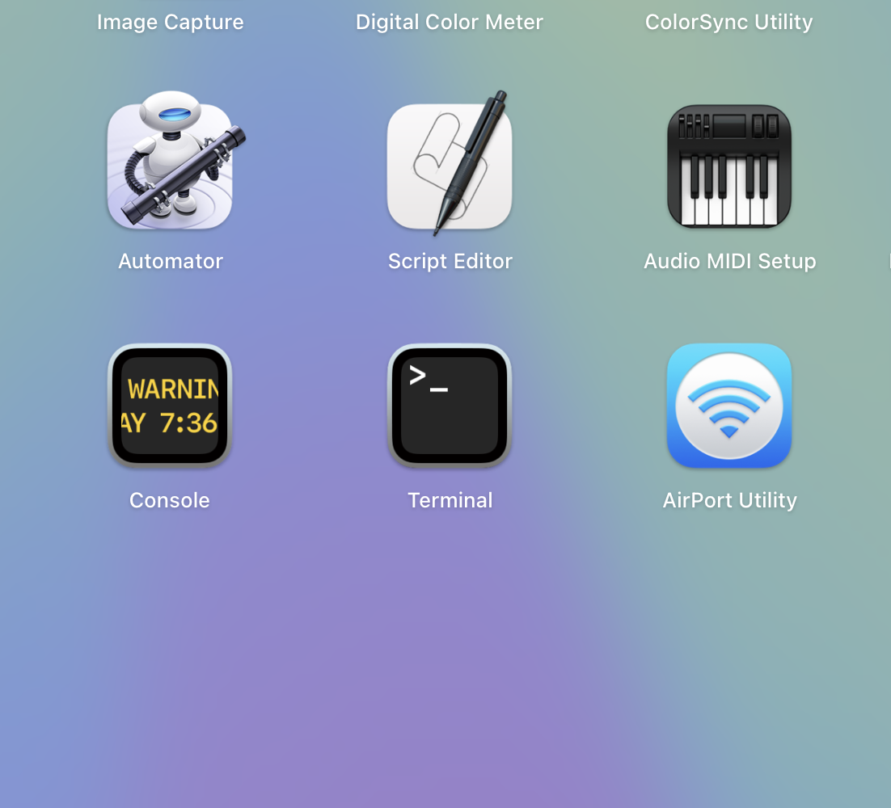
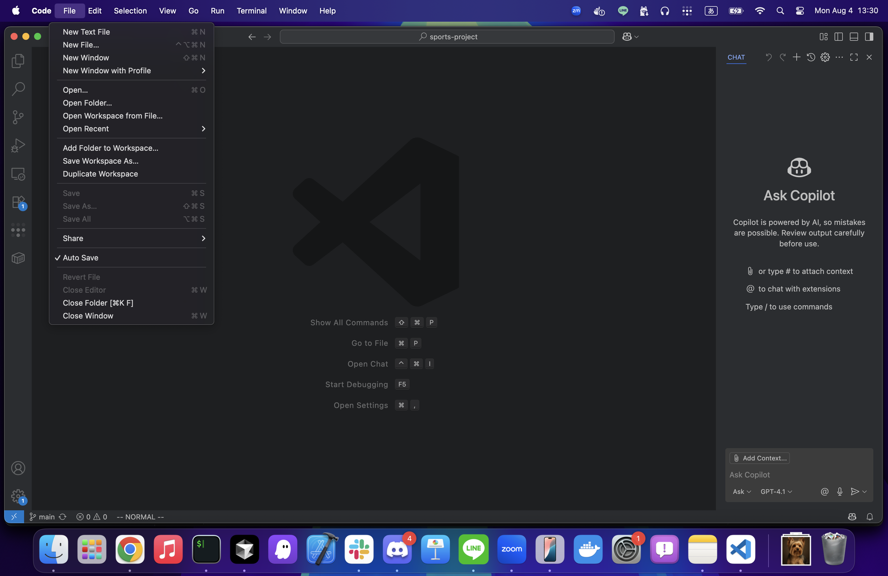
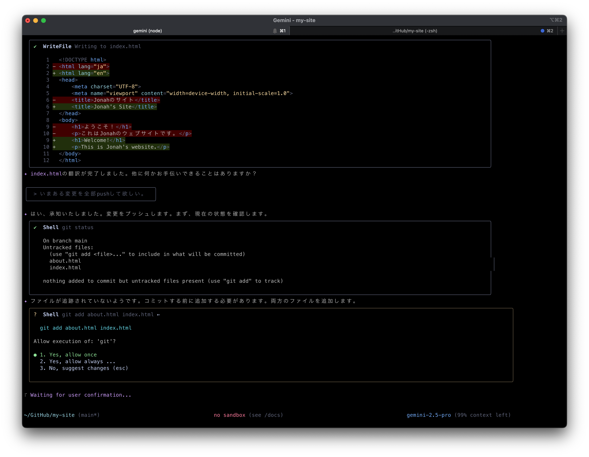
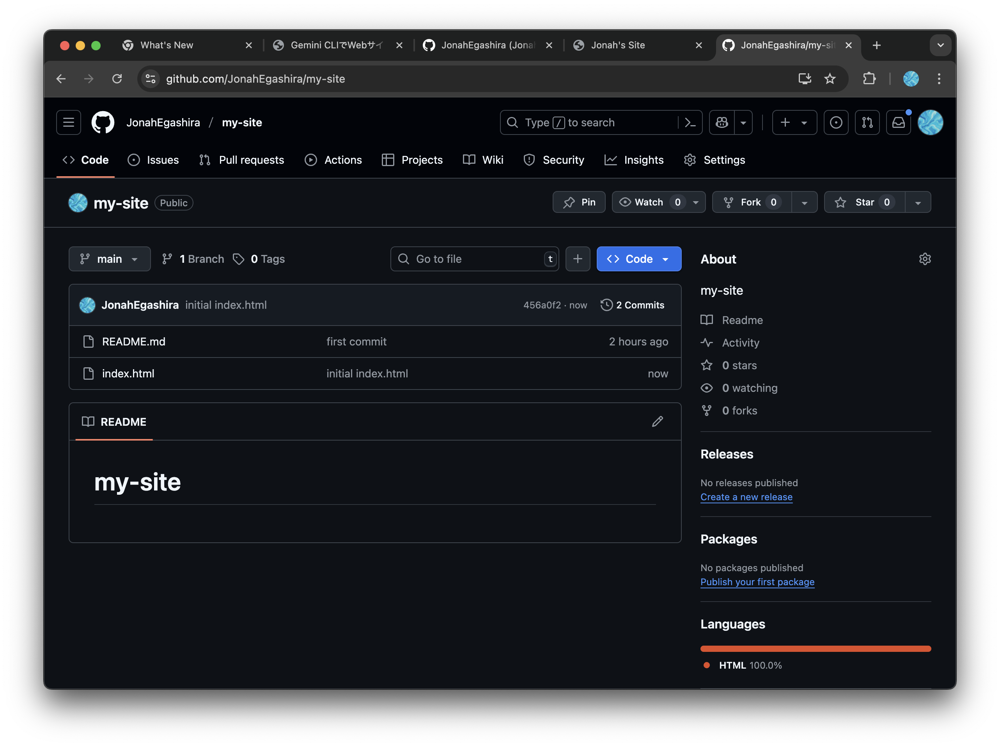

# ローカル環境構築編

- 自分のPC上でGemini CLIを利用したい人向けの資料です。ローカルでGemini CLIを利用できるようになると、ファイル・フォルダ操作の自動化や、手元にある文書ファイルをGeminiが編集してくれるようになったりします。今後開発をしてみたいという方も、ローカルで開発環境を準備するのがおすすめです。準備は少々大変ですが、フォローアップも行いますので、ぜひ興味のある人は取り組んでみてください。

## Gitの準備とローカル操作（Mac / Windows）

### 1. ターミナルを開く

<details markdown="1"><summary>Macの場合</summary>

* 標準の **「ターミナル」** アプリを使います 

1. Finderで「アプリケーション → ユーティリティ → ターミナル」を開く
   または **Spotlight検索（⌘+Space）** で「ターミナル」と入力して起動します
2. 黒い（または白い）ウィンドウが開きます
3. ここで以降のコマンドを入力します

</details>

---

<details markdown="1"><summary>Windowsの場合</summary>

* **おすすめ**：Gitをインストールすると一緒に入る **Git Bash** を使うと便利です
  （黒い画面にLinux風のコマンドが使える）

1. [Git for Windows](https://gitforwindows.org/) をダウンロードしてインストール
2. スタートメニューで **「Git Bash」** を検索して起動
   （黒いウィンドウが開きます）
3. ここで以降のコマンドを入力します

※ もしPowerShellやコマンドプロンプトしか使えない場合も同じコマンドが使えますが、Git Bashのほうが初心者にはやさしいです

</details>

### 2. Gitが入っているか確認

```bash
git --version
```

* **バージョン番号が表示されればOK**
* Macでは入っていない場合、自動で「開発者ツールをインストールしますか？」と聞かれるので「はい」を選びます
* Windowsで「command not found」や「認識されません」と出たら、Gitがインストールされていないので、[Git for Windows](https://gitforwindows.org/)をインストールしましょう。

---

### 3. SSHキーを作成してGitHubと接続

#### **SSHキー作成**

```bash
ssh-keygen -t ed25519 -C "あなたのメールアドレス"
```

* **Enter**を3回押す（パスフレーズは空でOK）
* キーは `~/.ssh/id_ed25519.pub` に作られます

### ⚠️注意事項⚠️

- `.pub`がついているファイルは**公開鍵**で、他人に公開しても問題ありません
- `.pub`がついていないファイルは**秘密鍵**で、絶対に他人に教えたり、Webサイト上に貼り付けたりしてはいけません

この点に注意して、SSHキーを安全に管理してください。

#### **公開鍵をコピー**

```bash
cat ~/.ssh/id_ed25519.pub
```

（WindowsのGit Bashでも同じコマンドでOK）

#### **GitHubに登録**

1. GitHub → 右上プロフィール → **Settings**
2. 左メニューの「**SSH and GPG keys**」をクリック
3. **New SSH key** を押す

4. **Title**：わかりやすい名前（例：My Laptop）
5. **Key**：コピーした公開鍵を貼り付け
6. **Add SSH key** を押す

---

### 4. 接続テスト

```bash
ssh -T git@github.com
```

* 「Hi [ユーザー名]!」と出ればOK

---

### 5. Gitのユーザー情報を設定

```bash
git config --global user.name "あなたの名前"
git config --global user.email "あなたのメールアドレス"
```

<details markdown="1"><summary>補足：💡SSHキーとは何か</summary>

* **SSH**（Secure Shell）は、インターネット越しに安全にサーバーとやりとりするための仕組みです
* **SSHキー**は「合鍵ペア」のようなもので、

  * **秘密鍵** → あなたのPCに保管（絶対外に出さない）
  * **公開鍵** → GitHubに登録してOK
* GitHubは「この公開鍵と合う秘密鍵を持っている人だけを信頼する」しくみ
* これにより、**毎回パスワードを入力せずに、安全に接続できる**ようになります

> **例えるなら…**
> 郵便受けに自分専用の鍵穴を付けて、鍵を持っているのはあなただけ。
> 郵便屋さん（GitHub）はその鍵でしか開かないようにしてくれる…そんなイメージです。
</details>

## GitHubでリポジトリを作成

### 1. GitHubで新しいリポジトリを作成

1. GitHubにログインし、<https://github.com/login> にアクセスしてログイン
2. ログイン後、<https://github.com/new> にアクセス
2. **New repository** のページが表示されます
3. **Repository name**：任意の名前を入力（例：`my-site`）
4. 他の設定はデフォルトのままでOK（**README**は作成しなくてOK. Choose VisibilityもPublicのまま）
5. **Create repository** をクリック

作成が完了したら以下のような画面になる。一旦ページはこのままにしておいて、次のステップに進む。


### 2.ローカルにリポジトリを作成し、GitHubのリポジトリと紐づける

1. ターミナル上でコマンドを打ってリポジトリを作成する
```bash
mkdir my-site # my-siteという名前のディレクトリを作成
cd my-site # my-siteのディレクトリに移動
echo "# my-site" >> README.md # READMD.mdというファイルを作成し、"my-site"という行を入れる
git init # そのディレクトリをGit管理する初期化コマンド
git add README.md # READMD.mdをGit管理する
git commit -m "first commit" # Git管理に追加した変更をコミットする（記録をつける）
git remote add origin git@github.com:<"あなたのアカウント名">/my-site.git # GitHub上のリポジトリに紐づける
git push -u origin main # GitHub上のリポジトリに、ローカルでの変更を適用する
```

- ここまでできたら、先ほど作成したGitHubのリポジトリのページを更新して確認してみてください。`README.md`というファイルが追加されているはずです

<details markdown="1"><summary>補足：💡mkdir, cd, echoコマンドの詳細</summary>

### **📂 mkdir**

* `mkdir`は「make directory」の略で、新しいディレクトリ（フォルダ）を作成するコマンドです
* 例：`mkdir my-site` は「my-site」という名前のディレクトリを作成します

---

### **📂 cd**

* `cd`は「change directory」の略で、現在のディレクトリを変更するコマンドです
* 例：`cd my-site` は「my-site」というディレクトリに移動します

---

### **📂 echo**

* `echo`は指定した文字列を出力するコマンドです
* 例：`echo "# my-site" >> README.md` は`README.md`というファイルに`# my-site`という行を追加します

</details>

---

## Gemini CLI のインストール

## Node.jsのインストール

Gemini CLIをインストールするために、`Node.js`という実行環境が必要になります
`Node.js`はJavaScriptをパソコン、サーバー上で実行するための環境で、Gemini CLIなどのツールをインストールする際も使用されます

### **Mac**

#### 方法1: 公式インストーラー（初心者向け）

1. **公式サイトへアクセス**
   <https://nodejs.org/>

2. **推奨版（LTS）をダウンロード**（macOS Installer）

3. **インストーラーを実行** → すべてデフォルトでOK

4. **確認**（ターミナル）

   ```bash
   node -v
   ```

---

### **Windows**

1. **公式サイトへアクセス**
   <https://nodejs.org/>

2. **推奨版（LTS）をダウンロード**
   緑色の **"LTS"** ボタンをクリック

3. **インストーラーを実行**

   * すべて「Next」でOK（特別な設定不要）
   * **"Add to PATH"** にチェックが入っていることを確認

4. **インストール確認**
   コマンドプロンプト（または PowerShell）で

   ```bash
   node -v
   ```

   バージョンが表示されればOK

---

#### 方法2: Homebrew（Macに慣れてる方向け）

1. **Homebrewインストール済み**か確認（なければ[公式](https://brew.sh/)）
2.ターミナルで

   ```bash
   brew install node
   ```
3. 確認

   ```bash
   node -v
   ```

<details markdown="1"><summary>補足：💡JavaScriptとNode.jsの関係</summary>

### 1. JavaScriptとは？
- **プログラミング言語**のひとつ
- 本来は**ブラウザの中で動く**ために作られた
- Webページに動きをつける、フォームの入力チェック、アニメーションなどで活躍

---

### 2. Node.jsとは？
- **JavaScriptをブラウザの外で動かせるソフトウェア（ランタイム環境）**
- Google Chromeの「V8 JavaScriptエンジン」を利用
- サーバーやパソコン上でJavaScriptを直接実行できる

---

### 3. 関係を一言でいうと
> **JavaScript**：言語そのもの  
> **Node.js**：その言語をパソコンやサーバーで動かすための実行環境

---

</details>

## Gemini CLIのインストール

以下のコマンドを実行してインストール
```bash
npm install -g @google/gemini-cli
```

<details markdown="1"><summary>補足：💡npmとは？</summary>

### npmとは？
- **Node Package Manager**の略
- Node.jsのための**パッケージ管理ツール**
- JavaScriptのライブラリやツールを簡単にインストール、管理、共有できる
- コマンドラインから利用可能で、`npm install`コマンドでパッケージをインストール

</details>

## Gemini CLIの実行

ローカルでの環境構築お疲れ様でした。ターミナル上で`gemini`と入力して、Gemini CLIを起動しましょう
```bash
gemini
```

このような画面が出たら成功です。

### VSCodeのインストールとコードの確認

今後コードの生成はGemini CLIがやってくれますが、手動で変更したい部分も出てきます。そこで、コードエディターであるVSCodeをインストールしましょう

1. **公式サイトへアクセス**
   <https://code.visualstudio.com/>

2. **ダウンロード**
   お使いのOSに合わせたインストーラーをダウンロードしてください

3. **インストーラーを実行**
   ダウンロードしたインストーラーを実行し、画面の指示に従ってインストールを完了させます

4. **VSCodeを起動**
   インストールが完了したら、VSCodeを起動します

5. **リポジトリを開く**
   - メニューから「ファイル」→「フォルダーを開く」を選択します
   - 先ほど作成したリポジトリのフォルダ（例：`my-site`）を選択し、「フォルダーを選択」をクリックします
   
6. **VS Codeの画面構成**
   - GitHub Codespaceと同じく、左側にファイル管理、中央にコードエディタ、下部にターミナル等がデフォルトでは配置されています。
   

- 基本的にはGemini CLIがコードの作成、編集など全ておこなってくれますが、一部分すぐに直したかったり、どんなコードが書かれているかを確認したい時はVSCodeなどのコードエディタをしようするのも便利です

### HTMLファイルをブラウザで表示する

HTMLファイルが作られていることが確認できたら、実際にブラウザ上でどんな見た目か確認してみましょう


### WindowsでHTMLファイルをブラウザで開く方法

1. **エクスプローラーでファイルを探す**
   - エクスプローラーを開き、作成したHTMLファイル（例：`index.html`）が保存されているフォルダに移動します

2. **ファイルをダブルクリック**
   - HTMLファイルをダブルクリックすると、デフォルトのブラウザでファイルが開きます

3. **右クリックメニューから開く**
   - HTMLファイルを右クリックし、「プログラムから開く」→「ブラウザ名」を選択して開くこともできます

### MacでHTMLファイルをブラウザで開く方法

1. **Finderでファイルを探す**
   - Finderを開き、作成したHTMLファイル（例：`index.html`）が保存されているフォルダに移動します

2. **ファイルをダブルクリック**
   - HTMLファイルをダブルクリックすると、デフォルトのブラウザでファイルが開きます

3. **右クリックメニューから開く**
   - HTMLファイルを右クリックし、「このアプリケーションで開く」→「ブラウザ名」を選択して開くこともできます

### 共通の方法

- **ドラッグ＆ドロップ**
  - HTMLファイルをブラウザのウィンドウにドラッグ＆ドロップすることで、ファイルを開くことができます

- **ブラウザの「ファイル」メニューから開く**
  - ブラウザを開き、メニューから「ファイル」→「ファイルを開く」を選択し、HTMLファイルを選択して開くことも可能です

これらの方法で、作成したHTMLファイルを簡単にブラウザで確認することができます


## HTMLをGitHub上のリポジトリにPush


### Pushとは

Pushとは、ローカルで行った変更をリモートリポジトリ（GitHubなど）に送信する操作のことです。これにより、他の開発者と変更を共有したり、リモートリポジトリを最新の状態に保つことができます

### Pushの方法

1. **変更をステージングする**
   - まず、ローカルで行った変更をステージングエリアに追加します
   ```bash
   git add .
   ```

2. **変更をコミットする**
   - ステージングエリアに追加した変更をコミットします
   ```bash
   git commit -m "変更内容の説明"
   ```

3. **リモートリポジトリにプッシュする**
   - コミットした変更をリモートリポジトリにプッシュします
   ```bash
   git push origin main
   ```
   - `main`はプッシュしたいブランチ名です。必要に応じて他のブランチ名に置き換えてください

これで、ローカルの変更がリモートリポジトリに反映されます。プッシュすることで、他の開発者と変更を共有し、プロジェクトを共同で進めることができます

## 🤖 Gemini CLIを使ったGitの操作

変更があるたびに、ターミナルに`git add .`とか、`git commit`とかを毎回打つのは面倒です。そこで、そのようなGitの操作も全てGemini CLIにお任せしてみましょう

```bash
user> いまある変更を全てpushして欲しい。
```



すると、Gemini CLIが現在の変更を確認するGitコマンド`git status`を実行し、現状を確認した上で`add`, `commit`, `push`までおこなってくれます

**⚠️注意⚠️** `git push`等は慎重に行いたいコマンドなので、allow alwaysにせず、allow onceで毎回確認するのがよいでしょう

### GitHub上でPushできているか確認

Pushが完了したら、GitHub上のリポジトリに正しく追加できているか確認してみましょう。先ほどGitHub上で作成したリポジトリに、index.htmlがあれば成功です

